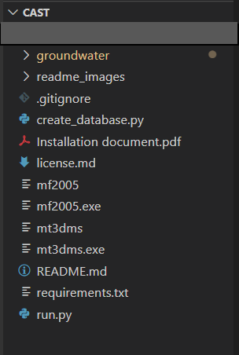
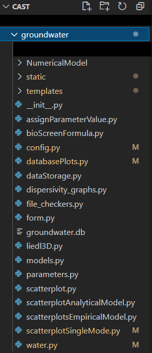

# i. Code Structure {.unnumbered}

{#fig-8-i-01 fig-align="center" width="60%"}

The structuring of CAST is as follows :

* `groundwater` : The main coding folder 
* `create_database.py` : Python file for creating/updating database 
* `run.py` : Python file for running CAST
* `mf2005, mf2005.exe,mt3dms,mt3dms.exe` : Executable files used by the numerical mode
* `requirements.txt` : Python packages/libraries used in the project

Other files include _readme_, _licensing_, _installation_ files etc.
@fig-8-i-01 shows the screenshot of the main code structure of CAST.

The struction of the main coding folder `groundwater` is as follows :

* `static` : Cascading Style Sheets, images, fonts, comma separated value files and JavaScript codes
* `templates` : HTML codes
* `NumericalModel` : Code for the numerical model

{#fig-8-i-02 fig-align="center" width="60%"}

Other files include python files consisting of routes, initialisation and integration codes for CAST.
@fig-8-i-02 shows the screenshot of the code structure of the `groundwater` folder of the CAST.
