### Using PACS OFFLINE ###

PACS is not necessary an ONLINE tool. It is essentially a browser-based tool, which can be used in both ONLINE and OFFLINE. However, for the OFFLINE use, **PACS** has to be installed in the local system. The OFFLINE set-up of PACS is provided below in detail.

::: {.callout-tip}
**The OFFLINE use of PACS is recommended, as parameter range limits used in ONLINE mode can be avoided**.
:::

#### Installation of Softwares required for successful running of PACS ####
The **offline** installation of PACS depends on _carefully_ following the steps that require few (open-source) software to be installed, and various system changes at the OS level to be made. The installation process is presented in steps below with outcomes (of each step) with the help of pictures. A careful read of the steps presented below before installing PACS can be very useful for the installation and offline use of the PACS. 

::: {.callout-important}
**The step presented below are for WindowsTM OS**.
:::

**PACS** can be installed in any OS. The intallation steps required for other OS (Linux/MacOSTM) will be documented later.

#### Step 1. Installation of the Github Desktop ####

Installation of [**Github Desktop**](https://desktop.github.com/) is **recommended** as it simplifies the _first_ installation process, specially for new users. Besides Github Desktop also simplifies any personalized modification of **PACS** code and updates.

 [Click to visit **Github Desktop**](https://desktop.github.com/) and follow the installation process. The screenshot below shows the interface of **Github Desktop** website.

 set-up](images/off_f1.png){#fig-of1 fig-align="center" width="40%"}

After the successful installation of Github Desktop, ``open`` the Github Desktop Application and click on ``clone a repository``. Under URL, paste the URL ``https://github.com/kamiz15/Groundwater-Contamination-Website.git`` as seen in the screenshot below. This can also be alternately seen under kamiz15/Groundwater-Contamination-Website on GitHub, under ``Code``.

::: {.callout-note}
The default branch of the current repository is used for local/offline setup.
:::

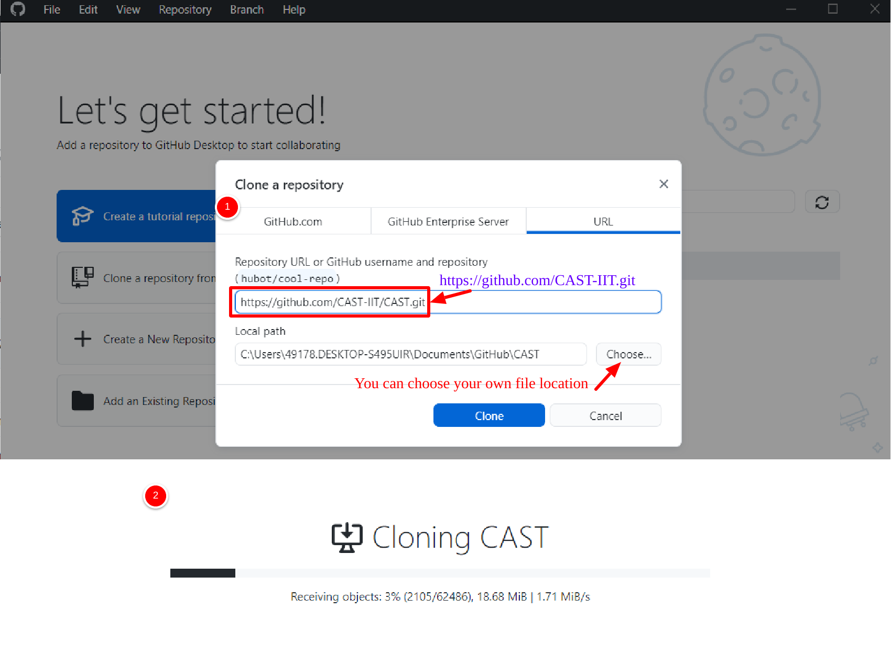{#fig-of2 fig-align="center" width="50%"}

The _cloning_ of the **PACS** will begin in your computer. You can store the cloned to your desired directory in your computer.

#### Step 2. Installation of Python system in the local computer ####

**Step 2A.** Downloading appropriate Python version : 

From the website ‘ https://www.python.org/downloads/ ’, download version 3.6.8 of Python (see steps in the screenshot below). You should choose 64 bit version. 

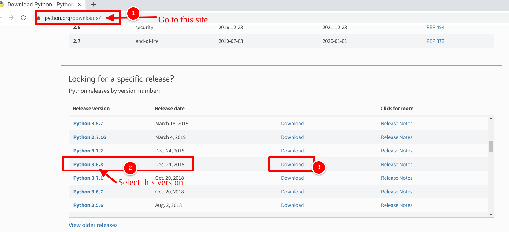{#fig-of3 fig-align="center" width="50%"}

::: {.callout-warning}
Python version 3.6.8 is **required**.  
:::
**Step 2B.** Installation of Python and adding its ``path`` to the system 

Open the Python executable ``.exe`` file that you downloaded Do not forget to check the box that says **Add Python 3.6 to Path**. Then, click on ``Install Now`` button (see the screenshot below).

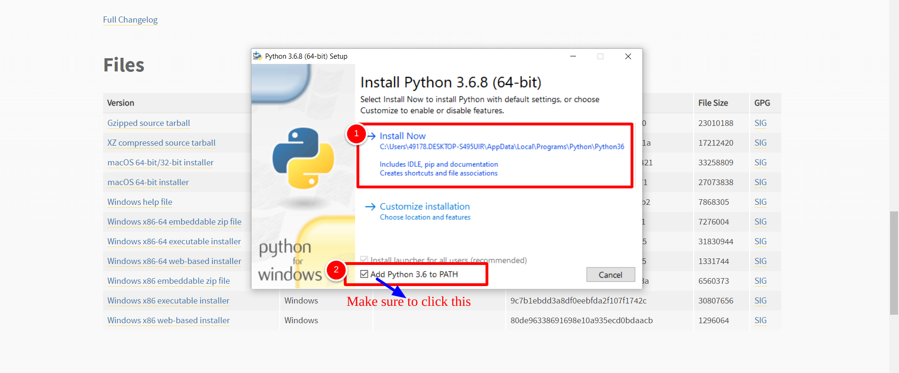{#fig-of4 fig-align="center" width="50%"}
 
**Step 2C.** Installation of ``pip``
``pip`` is Python package (library) management system. After completion of Python setup, it is a mandatory step to check if ``pip`` is also installed and for the required version of the Python, for that we go to the ``Command Prompt`` and type ``pip --version``. When pip is instlled, it's version will be the output (see screenshot) 
   
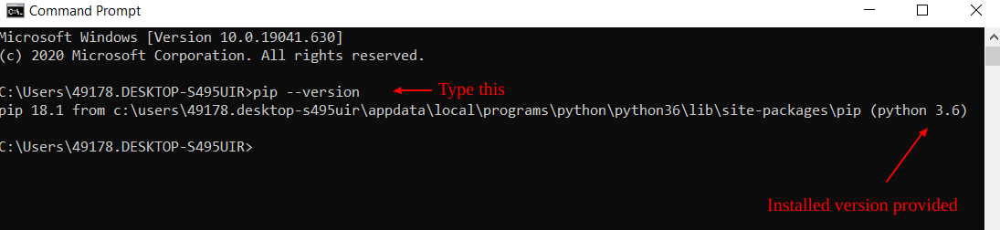{#fig-of5 fig-align="center" width="70%"}

**Step 2D.** Installation of ``pip`` when not installed
In case **no** pip version is found, we can install it through command prompt by entering the command- ``python get-pip.py``. Once installed it is a good idea to re-check the installed pip. Re-checking can be done using ``pip --version`` as above. Additionally, to verify the version of python, we can see it through the  line of command ``python --version``

**Step 2E.** Installation of **Virtual Environment (VE)**:  

A [Virtual Environment](https://docs.python.org/3/library/venv.html) (VE) is a _tool_ or a _folder_ that helps to keep dependencies required by different Python projects separate. PACS is a Python project, as such we create a separate Python system (a VE) for PACS. This can be easily done using command prompt (see screenshot below) and entering the command ``pip install virualenv``. 

::: {.callout-note}
``virtualenv`` is an independent Python [library](https://virtualenv.pypa.io/en/latest/) and it can be installed out of PACS directory. 
:::

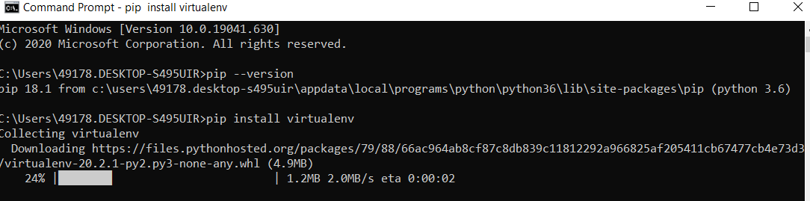{#fig-of6 fig-align="center" width="70%"}

**Step 2F.** Setting-up Virtual Environment (VE) for the **PACS** project

::: {.callout-caution}
Make sure you are in the **PACS** directory-
:::

- Create Virtual Environment files:
Make sure you are in the **PACS** directory- the directory where you stored the _cloned_ PACS repository (see **Step 1**). Look at the below screenshot:

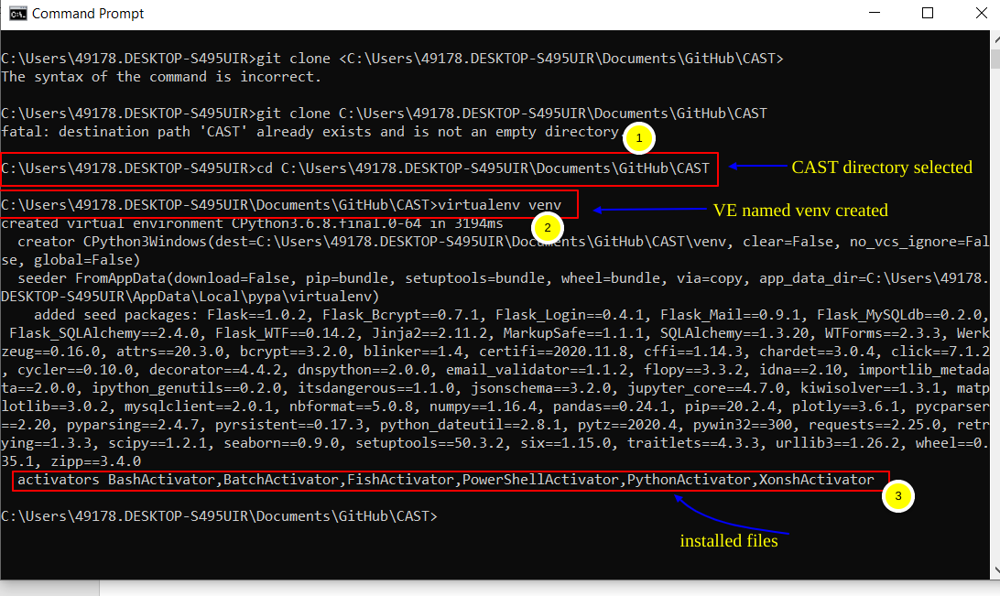{#fig-of7 fig-align="center" width="70%"}

- Activation of VE venv:

::: {.callout-caution}
Make sure you are in the **PACS\venv\Scripts** directory-
:::
 The created VE venv has to be activated before it can used. This can be done using the command ``activate`` in the ``venv\Scripts`` directory of PACS (see screenshot below). Once activated, you will see the ``<venv>`` at the start of the prompt (see screenshot) 

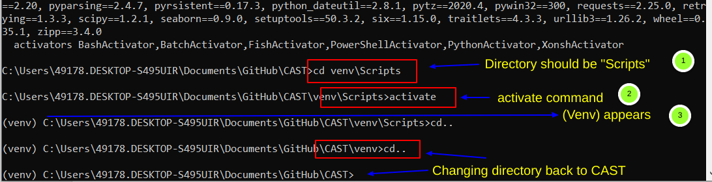{#fig-of8 fig-align="center" width="70%"}

#### Step 3. Installing Python libraries required by the **PACS** project ####
With VE created and activated, it is now time to install the Python libraries that are used in PACS. The required libraries are listed in the **.txt** file called ``requirements.txt``. There are several libraries to be installed, e.g., Numpy, Scipy, Matplotlib. Depending on your (internet) connection speed it may take up to 30 minutes (typically for High-speed connection) for installing all the required libraries.

The installing is easy a single _pip_ command ``pip install -r requirements.txt`` will get it all done (as in the screenshot below). 

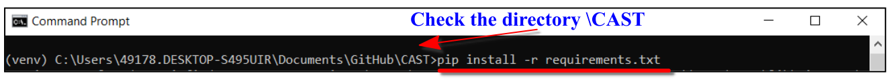{#fig-of8a fig-align="center" width="70%"}

::: {.callout-important}
- The ``pip install -r requirements.txt`` command must be used in the **PACS** directory.
- Do **not** close the the command prompt after all requirements.txt operation is complete.
:::

#### Step 4.	Setting up MySql ####

[MySql](https://www.mysql.com/) is an _open-source_ relational database management system (RDBMS). In **PACS** database is used for managing user account such that user can save their input and output data. For **ONLINE** PACS this means users can retrieve their input at later time. For **OFFLINE** PACS the same structure can be used in the environment when there are multiple people using PACS. User account creation is detailed [here](../online/login.qmd).

Below step-wise setting up of Mysql is provided. 

- Visit the _webpage_ to download the Mysql installer file [http://dev.mysql.com/downloads/installer/](http://dev.mysql.com/downloads/installer/)  
  
- In the _webpage_, download the file that is about 400 MB (**the offline version**) in size and start the setup. 
  
- Choosing a Setup type: Chose **FULL** (see screenshot)  

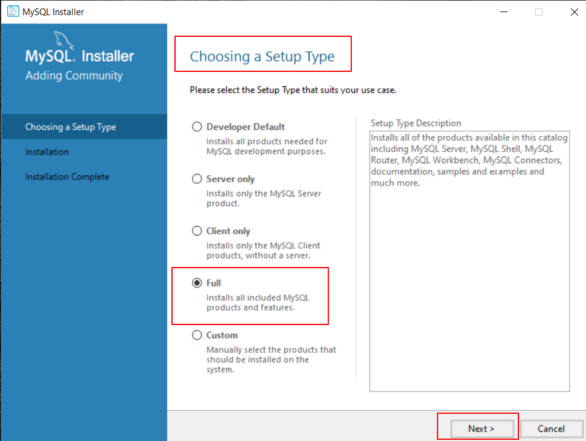{#fig-of9 fig-align="center" width="70%"}

- Keep on selecting _default_ set-up by clicking **next**  or **execute**. Please do not skip any steps though.  Different components of MySql will be installed during the process. The screenshot below shows the steps. 

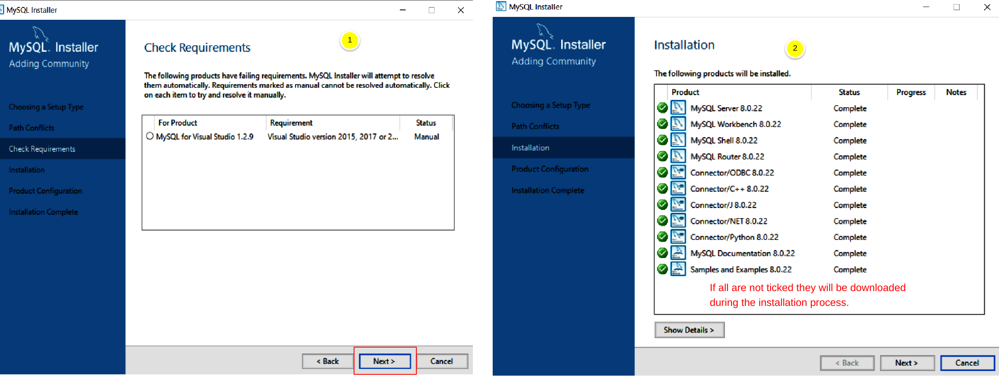{#fig-of10 fig-align="center" width="40%"}

- Keep the **default** set-up option as is it and continue until the ``account setting`` screen is obtained (see screenshot below). Set your **password** and make sure to **remember** this password as in the next few steps, during application of configuration, we can check for the password if it is correct or not.  Not to worry if the password is a _weak_ (although try to use a strong) one.

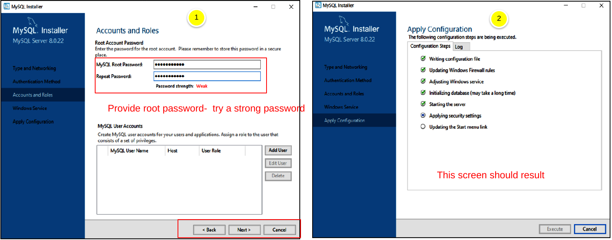{#fig-of11 fig-align="center" width="50%"}

::: {.callout-note title="Kanishk Pls. check"}
:class : warning
**Do you remember how much time it takes here. I think in one of the step it takes 20-30 minutes. We need to mention that.**
:::

- A window **Connect to Server** (see screenshot below) will appear. In this window, _insert_ the **password** that you created in the previous step  and _click_ on the ``check`` button.

::: {.callout-caution}
Make sure that you do not forget the **password**. The entire MySql set-up have to repeated if you forget the password.
:::
   
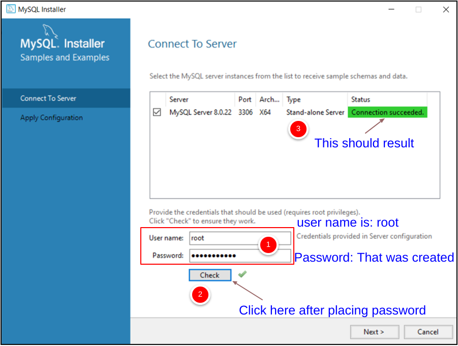{#fig-of12 fig-align="center" width="70%"}

- After setting  up MySql, open **MySql Workbench** using WindowsTM  _start-menu_. Click on ``Connections`` and when asked, enter the root ``password`` created during the MySql setup. You should get the windows as shown in the screenshot below
  
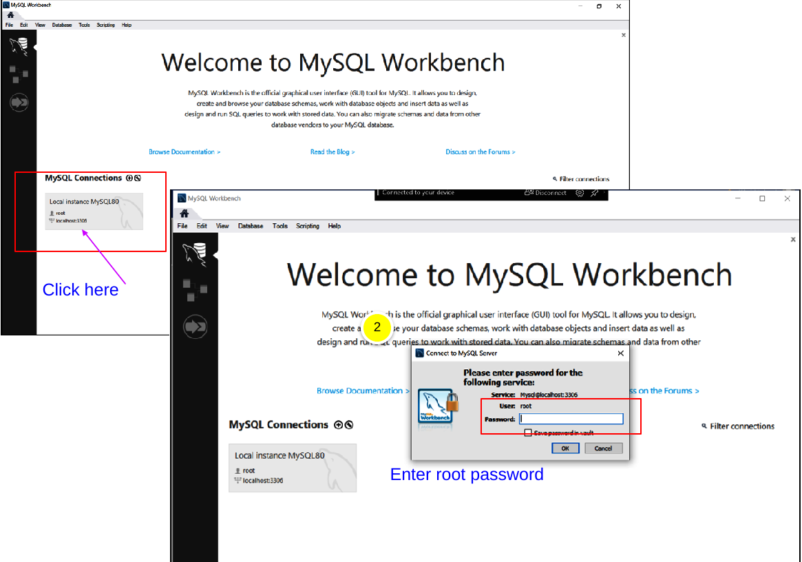{#fig-of13 fig-align="center" width="70%"}

- Create a **database** named ``groundwater`` in the new page. This can be done by writing the command ``create database groundwater`` in the windows space (see screeshot). Once the command is written, **click** on the ``lightning button`` (It is used to execute), and _wait_ until action is shown (see the screenshot) in the bottom. 

{#fig-of14 fig-align="center" width="70%"}

::: {.callout-note}
``groundwater.db`` is the database that PACS centrally uses. When codes are updated, this database has to be updated. 
:::
#### Step 5. Executing OFFLINE PACS ####

With creation of the (groundwater) database, setting-up MySql is complete. Next, we move to connect the **OFFLINE PACS** with the local server, the database and the code. These steps are simplified (at least for less CS/IT experts) using specialized text-editor/IDE such as [**Visual Studio Code**](https://code.visualstudio.com/), [**PyCharmTM**](https://www.jetbrains.com/pycharm/). In the description we use **Visual Studio Code**. The steps below explains the steps.

- In **Visual Studio Code**, open the ``file`` location; here select **PACS** (the cloned folder in Step 1) and click on ``Open Folder``.

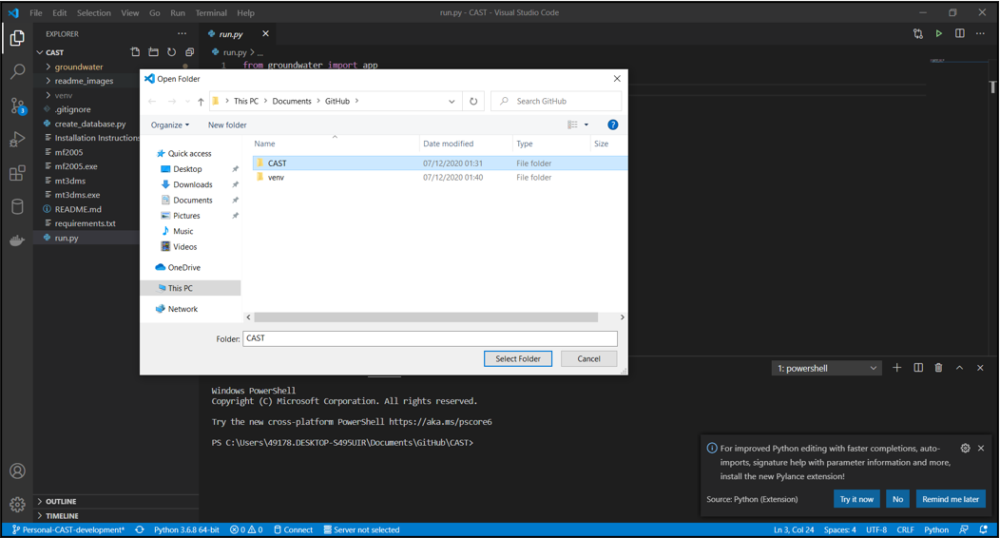{#fig-of17 fig-align="center" width="70%"}

- In the Visual Studio Code on the left-side select the file ``groundwater>config.py``, and change the **password** that was used for setting-up of MySql in **STEP 4** (see screenshot below). 

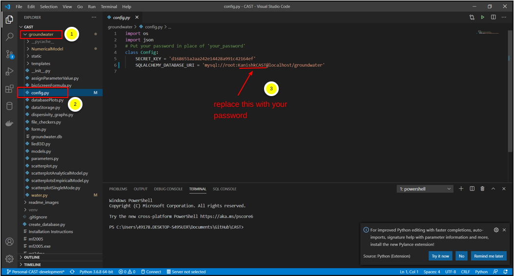{#fig-of18 fig-align="center" width="70%"}

- Now populate the (groundwater) database with the command  ``python3 create_database.py`` or ``py create_database.py`` in the **command prompt** (**STEP 2**), in which virtual environment ``venv`` is active- as seen in the screenshot below.

::: {.callout-note}
Make sure you are in the **\PACS** directory and NOT in the **\venv\Scripts** or other directory. 
:::

{#fig-of14-2 fig-align="center" width="40%"}

- Under ``groundwater/water.py``, change the ``parent_dir= ‘your directory\\PACS``. Note the double-blackslash (\\) used in directory address. This Python programming standard. This is explained in the screenshot below  

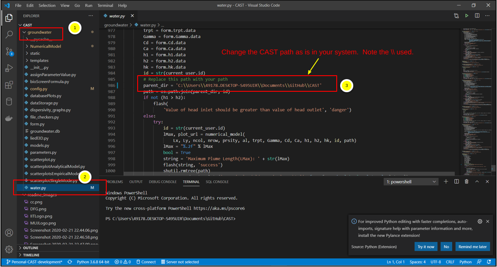{#fig-of19 fig-align="center" width="70%"}

- The numerical model of **PACS** uses [MODFLOW](https://www.usgs.gov/software/modflow-2005-usgs-three-dimensional-finite-difference-ground-water-model) and [MT3DMS](https://hydro.geo.ua.edu/mt3d/index.htm). The MODFLOW and MT3DMS **.exe** files are called during the numerical model execution. Therefore, the location of **.exe** files in user's computer have to specified in the PACS code system. This has to be done in the PACS file **groundwater/NumericalModel/numericalModel.py** as shown in the screenshot below 

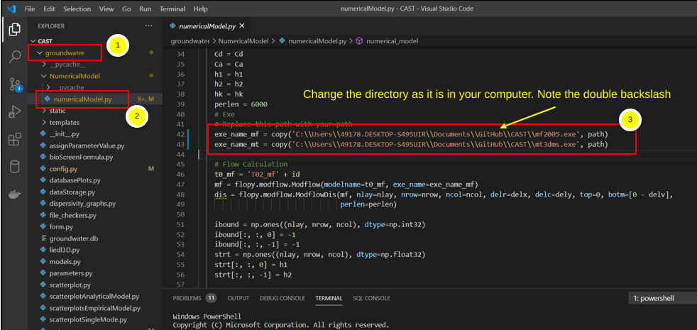{#fig-of20 fig-align="center" width="70%"}

- The next step requires that the Python executable used in the developed of PACS that is in virtual environment ``venv``. In **Visual Studio Code** this can be done is the step-wise manner as shown in the screenshots below.

- Click on the interpreter below and select the ``python interpreter -> virtual environment`` that you want to work in 

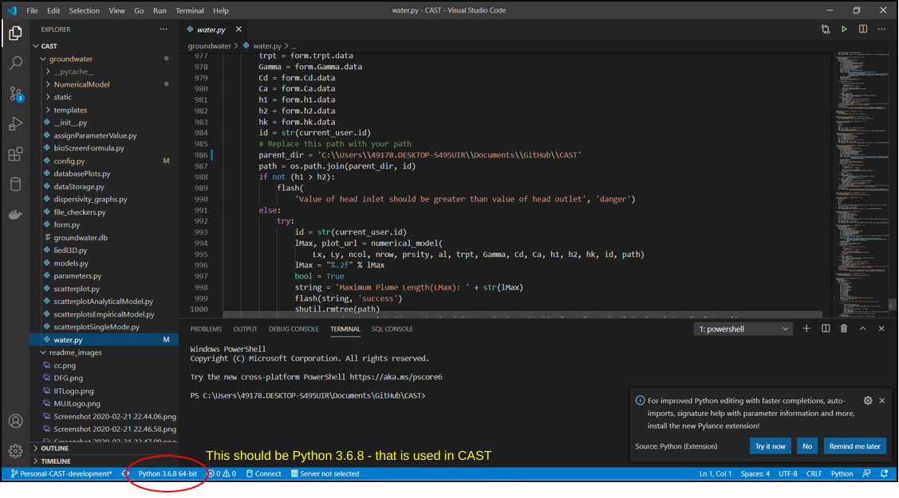{#fig-of21 fig-align="center" width="70%"}

- In case the Python interpreter is not of the **PACS** virtual environment ``venv``, it should be changed. This can be done by clicking on the Python version seen in Visual Studio Code bottom bar. The screenshot below should appear. 

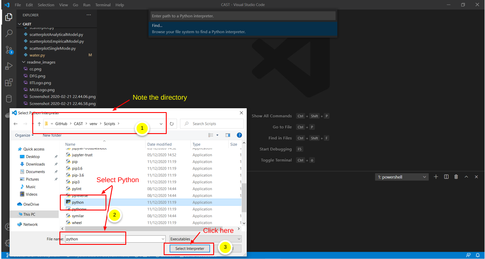{#fig-of22 fig-align="center" width="70%"}

- Go to the file  ``run.py`` that is on the left panel of the Visual Code Studio interface, and on the _top right corner_ click on the ``green play button`` to run it. See the screenshot below.  

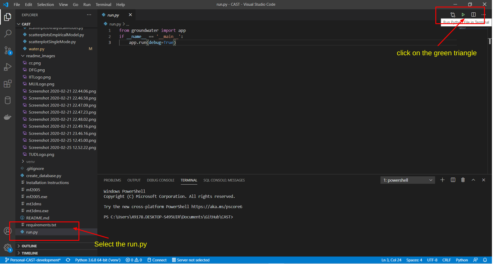{#fig-of23 fig-align="center" width="70%"}

- At the bottom panel (see screenshot) of the Visual Studio Code, a hyperlink will appear when PACS is executed correctly. The hyperlink has to be copied and pasted in a browser to run PACS. 

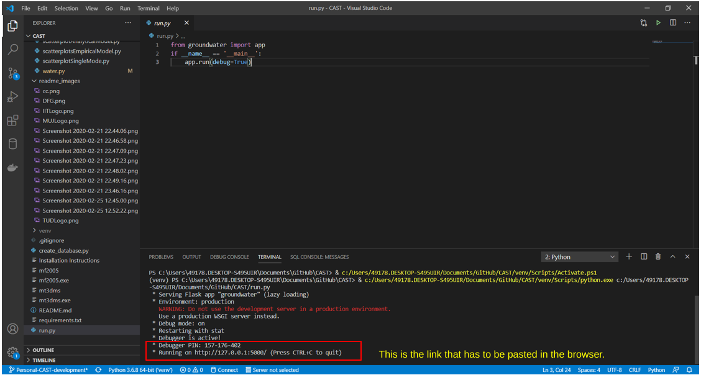{#fig-of24 fig-align="center" width="70%"}

- The screenshot below should appear once the hyperlink is executed in the browser.

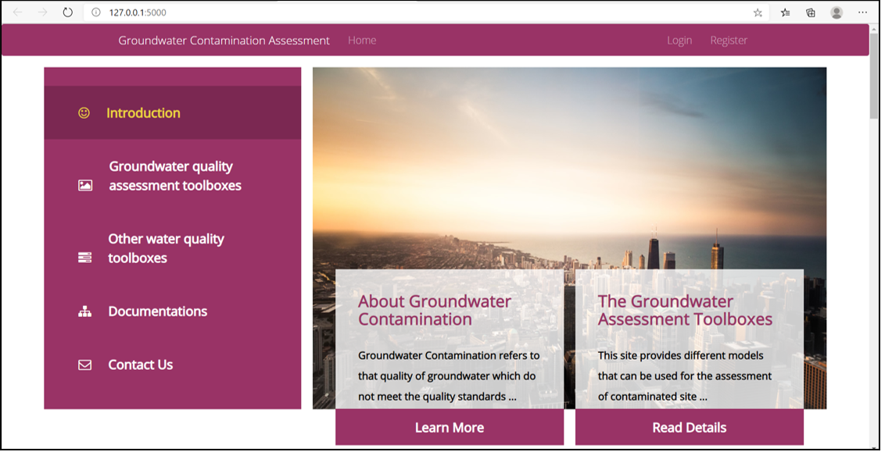{#fig-of25 fig-align="center" width="70%"}

- **Optional step** 
::: {.callout-important title="Issue with running script in WindowsTM"}
The WindowsTM may give the following error:

**Files cannot be loaded because running scripts is disabled on this system. Provide a valid certificate with which to sign the files.**
:::
This error can be addressed using the solution provided [here](https://www.beaming.co.uk/knowledge-base/resolved-files-cannot-loaded-running-scripts-disabled-system/) (also see the screenshot). The error is due to default security block of WindowsTM for running the script.

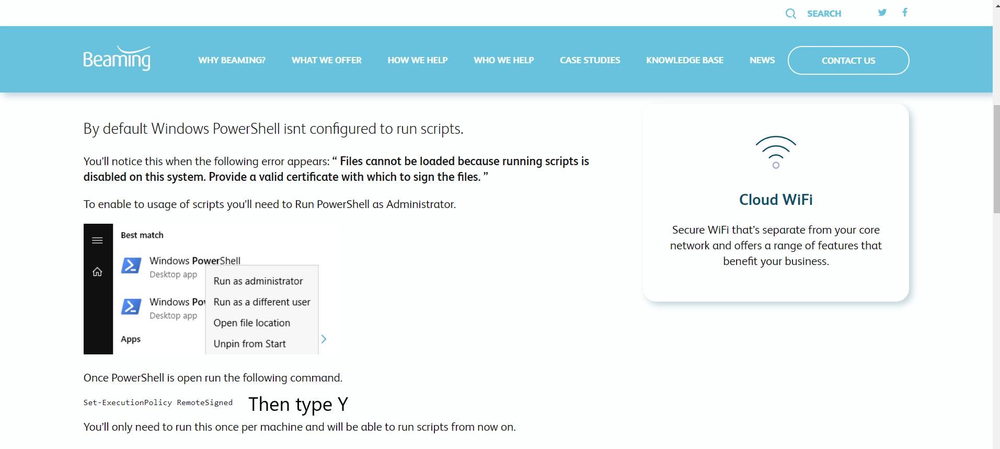{#fig-of16 fig-align="center" width="50%"}

You can log in with your email ID and a password. The server can be closed/stopped by clicking ``Ctrl+C`` in the Visual Studio Code.

For re-running the server or using the OFFLINE PACS steps provided in @fig-of23 and @fig-of24 has to be executed. 

