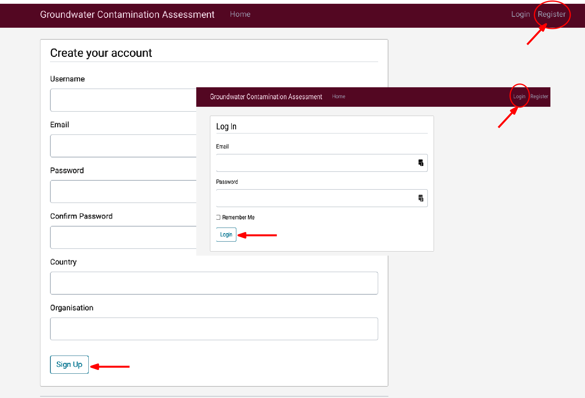
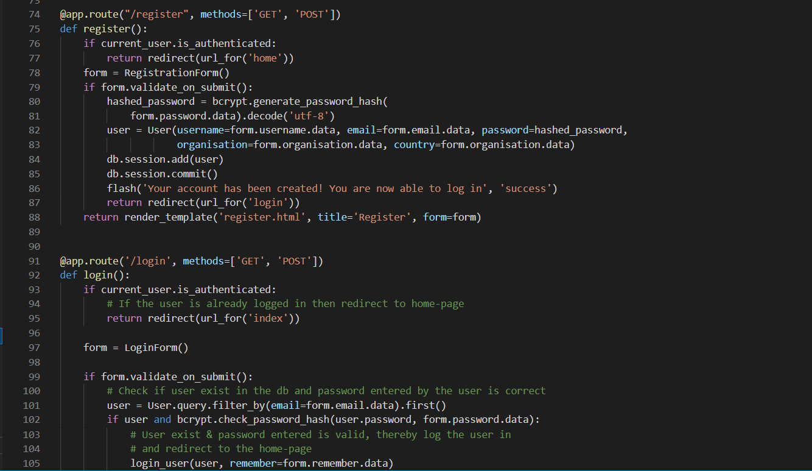

## User Login and Access for Online PACS 

**PACS** offers the option for users to store their personal site data and perform analysis with the built in database and more. Hence, a login is necessary in order for the system to know which user is accessing the website so that their respective data can be loaded, the user does not have to load their data repeatedly as it is securely saved using [MySQL](
MySQLwww.mysql.com). 

Without login, a user can surf the site and read about Groundwater Contamination, the Groundwater Assessment Toolboxes provided, user guide, complete documentation and credits.

For registering, a user needs to enter a username(does not have to be your name, any fictitious name can be used), an email (can be a non-functioning email also, like xyz@gmail.com), password, country (this can be filled in as NA as well) and lastly organisation (can be filled with NA as well).  

@fig-on1 provides the _user_ registration and _login_ interface of the PACS.

{#fig-on1 fig-align="center" width="40%"}

**No information** entered in PACS is cross verified, the user login is only required to keep each user's data separated and store it for their convenience for later usage.
This also means that a loss of user registration or login information can not easily be retrieved. 

{#fig-on2 fig-align="center" width="50%"}

@fig-on2 above shows the registration code used in PACS, there are no cross verification of user information as can been seen in the code. Also, user passwords is encrypted before storing.