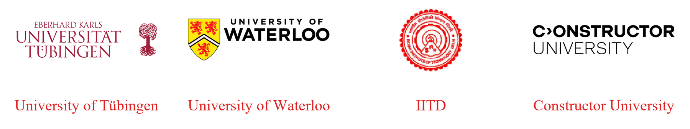

# i. Cite PACS {.unnumbered}

PACS is an open-source project and therefore many have contributed with different aspects of its development. The order in which **names** are mentioned below do not follow any contribution level order.

## Publication

1. P. K. Yadav, A. V. Köhler, A. Yadav, K. Ziza, M. Tripathi and S. Sreelekshmi, Initial assessment of contaminated site using multiple, Environmental Modelling and Software (Submitted for publication)

## Core Code Development and Documentation

1. P. K. Yadav
2. A. V. Köhler
3. A. Yadav
4. K. Ziza
5. M. Tripathi
6. S. Sreelekshmi
7. And Others

## Online Implementation

1. K. Ziza

## Funding Support

1. Partially through DFG fund (YA 945/1-1, GR 971/37-1, and DI 833/27-1)

{#fig-9-i-01 fig-align="left" width="40%"}

## Organizational Support

The following organizations are supporting PACS:

1. University of Tuebingen, Tuebingen, Germany
2. University of Waterloo, Waterloo, Canada
3. Indian Institute of Technology Delhi (IITD)
4. Constructor University

{#fig-9-i-02 fig-align="center" width="85%"}
