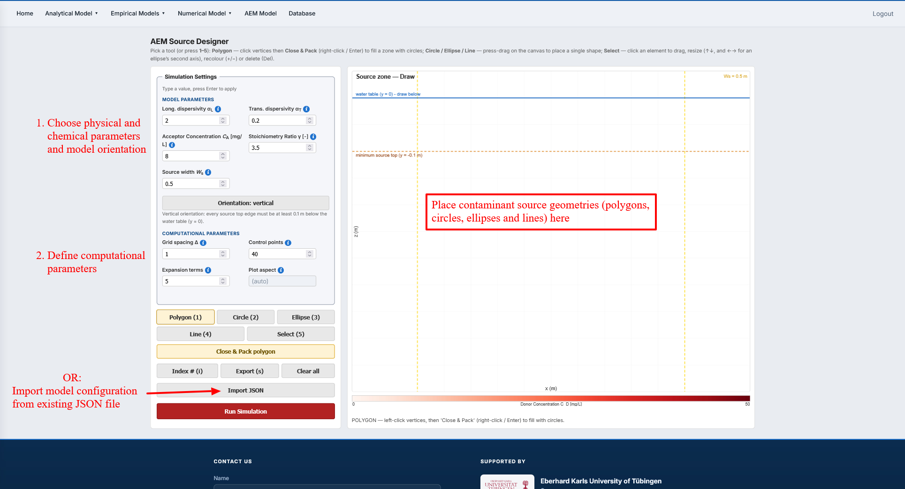
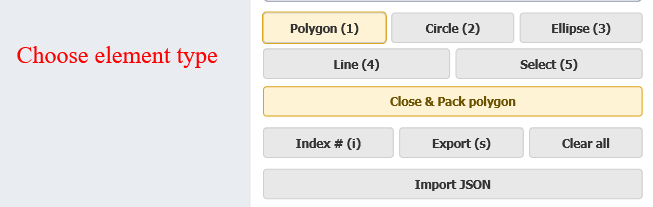
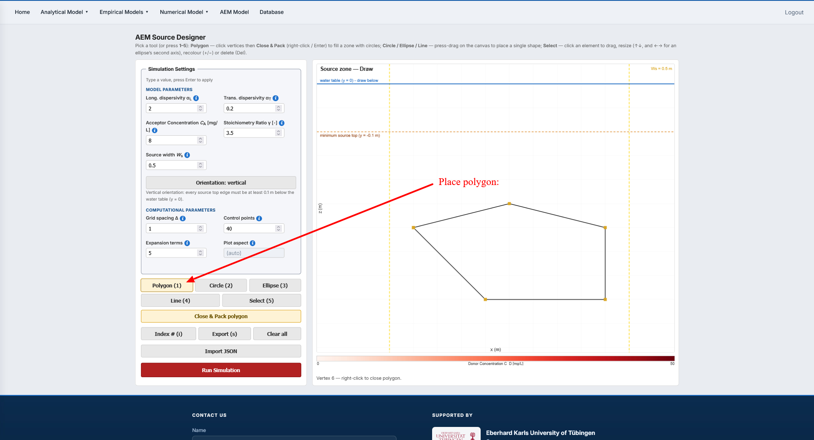
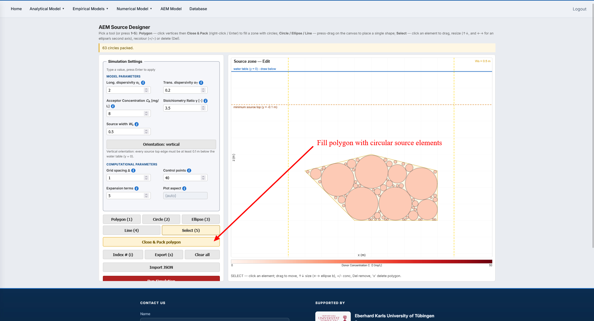
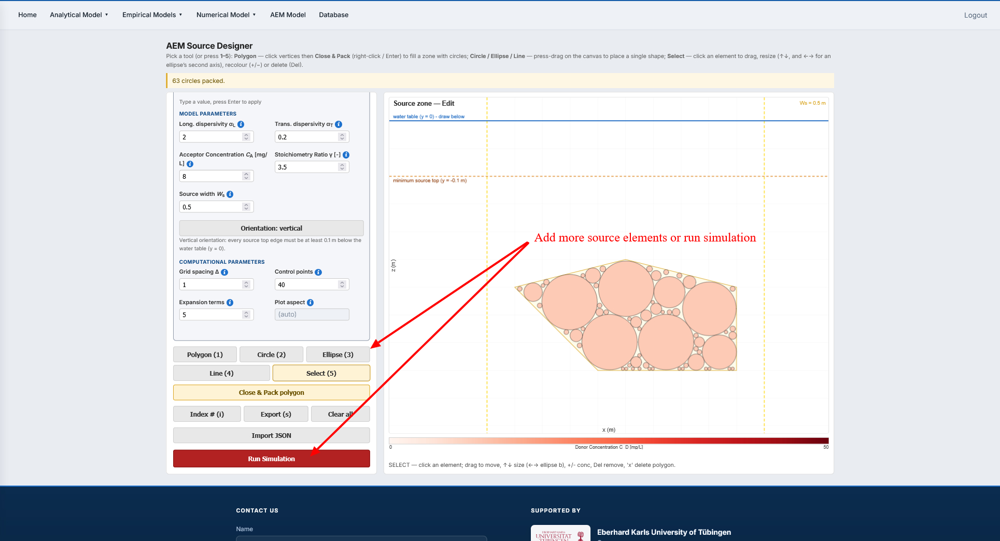
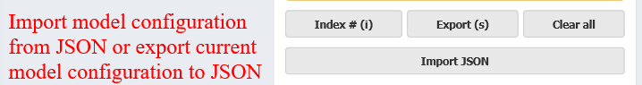

# 4. Analytic Element Method (AEM) Transport Model and Complex Source Designer {.unnumbered}

## i. Model background {.unnumbered}

The model is based on *Köhler et al. (2026a)* and *Köhler et al. (2026b,
submitted)*, which present solutions for reactive contaminant transport from
circular, elliptical, and line sources under conditions similar to those
described by *Liedl et al. (2005)*. An electron donor and electron acceptor
undergo an instantaneous reaction at the fringe of a steady-state contaminant
plume. The modelling process determines the plume length and the distributions
of donor and acceptor under varying boundary conditions.

A key capability of the AEM approach is the superposition of multiple
contaminant sources in one domain. Each source is represented by a series of
Mathieu functions. These series expansions are closed-form analytical solutions
to the transport problem, so the method does not solve the transport equations
numerically on a spatial grid. For detailed model descriptions, refer to
*Köhler et al. (2026a, 2026b)* and *Liedl et al. (2005)*.

## ii. Source designer features {.unnumbered}

The Source Designer models the steady-state contaminant plume produced by a
complex source. After specifying the physical and chemical model parameters,
the source geometry is built by placing multiple source-element types with
different sizes and concentrations on the source pane. Available element types
are polygons, circles, ellipses, and lines.

## iii. Input parameters and physical meaning {.unnumbered}

- **Longitudinal dispersivity** $\alpha_L$ [m]: Describes spreading of the
  transported compounds along the groundwater-flow direction.
- **Transverse dispersivity** $\alpha_T$ [m]: Refers to vertical-transverse
  dispersivity in the vertical orientation and horizontal-transverse
  dispersivity in the horizontal orientation. Different values may therefore
  be appropriate for the two orientations.
- **Acceptor concentration** $C_A$ [mg/L]: Concentration of the compound that
  reacts with the contaminant. Depending on the model orientation, the acceptor
  is supplied either by atmospheric input through the capillary fringe
  (vertical) or by upstream saturated groundwater (horizontal).
- **Stoichiometric ratio or utilization factor** $\gamma$ [-]: Moles of
  acceptor consumed when one mole of donor reacts.
- **Source-zone extent** $SZE$ [m]: Longitudinal extent within which the
  contaminant source is located.
- **Orientation**: Vertical or horizontal model orientation.
- **Resolution**: Resolution at which the concentration distribution is
  evaluated and plotted.
- **Control points**: Number of points used to determine the accuracy of the
  solution along the source boundary conditions.
- **Expansion terms**: Number of terms in the Mathieu-series expansion. More
  terms may slightly improve accuracy, but may also make the solution unstable.

## iv. Simulation workflow {.unnumbered}

@fig-4-iv-01 identifies the main areas used to configure the model and construct
the source zone.

{#fig-4-iv-01 fig-align=center width=90%}

1. Choose the model orientation.
2. Define the physical, chemical, and computational input parameters.
3. Either import an existing source-zone configuration with **Import JSON**, or
   configure a new source zone on the canvas.
4. Choose the required element type as shown in @fig-4-iv-02. The available
   tools are **Polygon (1)**, **Circle (2)**, **Ellipse (3)**, **Line (4)**, and
   **Select (5)**.

{#fig-4-iv-02 fig-align=center width=60%}

5. To create a polygonal source zone, select **Polygon (1)** and place its
   vertices on the source pane as shown in @fig-4-iv-03.

{#fig-4-iv-03 fig-align=center width=90%}

6. Select **Close & Pack polygon** to fill the polygon with circular source
   elements as shown in @fig-4-iv-04.

{#fig-4-iv-04 fig-align=center width=90%}

7. Add further source elements if required. Use **Select (5)** to choose an
   element, drag it to a new position, resize it with the arrow keys, or change
   its concentration with the **+** and **-** keys. Use **Index # (i)** to
   toggle element indices. When the configuration is complete, select
   **Run Simulation** as shown in @fig-4-iv-05.

{#fig-4-iv-05 fig-align=center width=90%}

8. Select **Export (s)** to save the current model configuration as JSON. The
   import and export controls are highlighted in @fig-4-iv-06.

{#fig-4-iv-06 fig-align=center width=60%}
