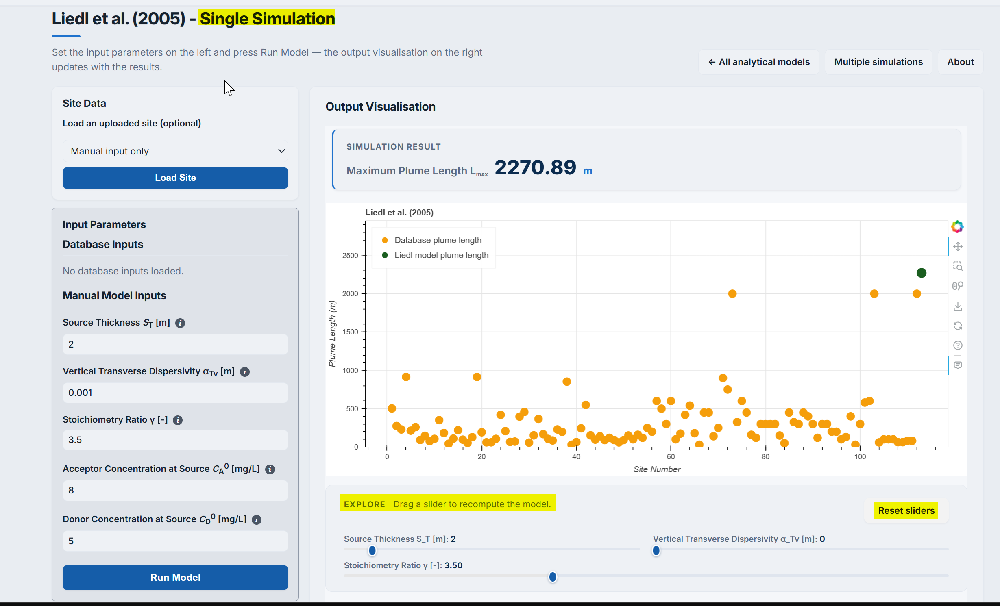
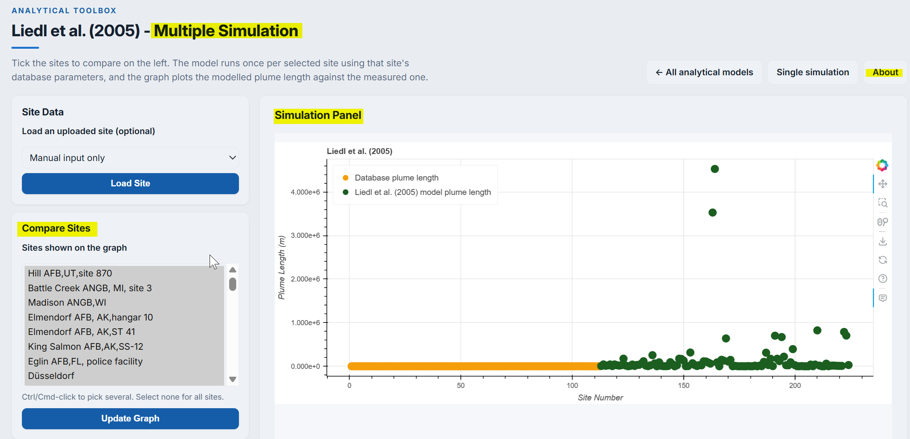

The analytical model toolbox within the PACS provides the solution for the steady-state plume length $L_{max}$. The toolbox currently includes **6** different models; each of them varying with the other with respect to model conditions, dimensionality, input quantities, and also orientation. Analytical model toolbox is the recommended step after the use of _Data Toolbox_ in the PACS work flow.

## Analytical models in PACS ##
Included models are (_see individual model page for details_):

1. [@liedl2005](liedl2005.qmd)

    $$L_{max}\frac{4T_s^2}{\pi^2 \alpha_{Tv}}\ln\bigg( \frac{4}{\pi}  \frac{\gamma C_{D}^o+ C_{A}^o}{C_{A}^o}\bigg)
$$

2. [@ham2004](ham2004.qmd) 

    $$L_{max} = \frac{W_e^2}{4\pi\alpha_{Th}}\bigg(\frac{\gamma C_D^\circ}{C_A^\circ}\bigg)^2$$

3. [@chu2005](chu2005.qmd)

    $$L_{max} = \frac{\pi}{16}\frac{W_s^2}{\alpha_{Th}} \Bigg(\frac{\gamma C_D^\circ }{C_A^\circ -\epsilon}\Bigg)^2 
$$
4. [@cirpka2006](cirpka2005.qmd) 

$$L_{max} = \frac{W_s^2}{
16 \alpha_{Th}\big[\text{erf}^{-1} \big(
\frac{C_A^o}{\gamma C_D^o + C_A^o}
\big)\big]^2}
$$

5. [@liedl2011](liedl2011.qmd)

    $$\text{erf}\Bigg(\frac{W_s}{\sqrt{4\alpha_{Th}L_{max}}}\Bigg)\,\text{e}^{-\alpha_{Tv}L_{max} \big(\frac{\pi}{2T_s}\big)^2} =\frac{\pi}{4}\frac{\gamma C_{Thres}+C_{A}^\circ}{\gamma C_{D}^\circ+C_{A}^\circ}
$$
6. [@karanovic2007 - **BIOSCREEN-AT**](bioscreen.qmd)

    $$C_D(x,y,z, t) = C_D^o \frac{x}{8\sqrt{\pi D_x'}}\exp(-\Gamma t) 
\times \int\limits_0^t\frac{1}{\xi^{3/2}}\exp\Bigg\{(\Gamma-\lambda_{e})-\xi \frac{(x-v'\xi)^2}{4D_x'\xi}\Bigg\}\times$$ 
$$\times \Bigg[\text{erfc}\Bigg\{\frac{y-\frac{W_s}{2}}{2\sqrt{D_y'\xi}}
\Bigg\}-\text{erfc}\Bigg\{\frac{y+\frac{W_s}{2}}{2\sqrt{D_y'\xi}}
\Bigg\}\Bigg]\times$$

$$\times \Bigg[\text{erfc}\Bigg\{\frac{z-T_s}{2\sqrt{D_z'\xi}}\Bigg\}
\text{erfc}\Bigg\{\frac{z+T_s}{2\sqrt{D_z'\xi}} 
\Bigg\}\Bigg]\text{d}\xi$$

## Computing interfaces in PACS ## 

PACS provide the following two computing interfaces for each analytical and empirical models:

I. Single computing interface \
II. Multiple computing interface

#### Single computing interface ####

The **single computing interface** is a quick computing mode in which a set of model data can be inserted in data input box to obtain $L_{max}$. The interface output (see screenshot @fig-fig3.0-i below) is actual $L_{max}$ and the plot in which the user input result is compared against the field plume length. The output graph has a few interactive options - such as zooming, panning, and obtaining figure as a `png` graphics.

::: {#fig-fig3.0-i}

{
width="80%" 
height="350px" 
fig-align="center" 
fig-alt="Screenshot of single simulation interface"}

Single computing interface

:::

The single computing interface also provide user interactivity with computation. Interface provide _sliders_ for changing parameter values, which leads to computation and visualization of $L_{max}$. 

#### Multiple computing interface ####

The **Multiple computing interface** provides a possibility to create simulation scenarios and compute $L_{max}$ for all scenarios at once (see screenshot @fig-fig3.0-ii below) . Scenarios can be directly put input in the table or can be uploaded to the interface. For uploading the sample input template (a `.csv` file has to be downloaded. After creating data in the *.csv* file, it can be uploaded to the interface for the $L_{max}$ computation. 

::: {#fig-fig3.0-ii}

{
width="80%" 
height="350px" 
fig-align="center" 
fig-alt="Screenshot of Multiple simulation interface"}

Multiple computing interface

:::

The computed $L_{max}$ is graphically displayed in the interactive figure. The obtained results can then be compared with the user selected data from the database.

The workflow with the computing interfaces can be to begin with either single or multiple interface based on the user requirements.

