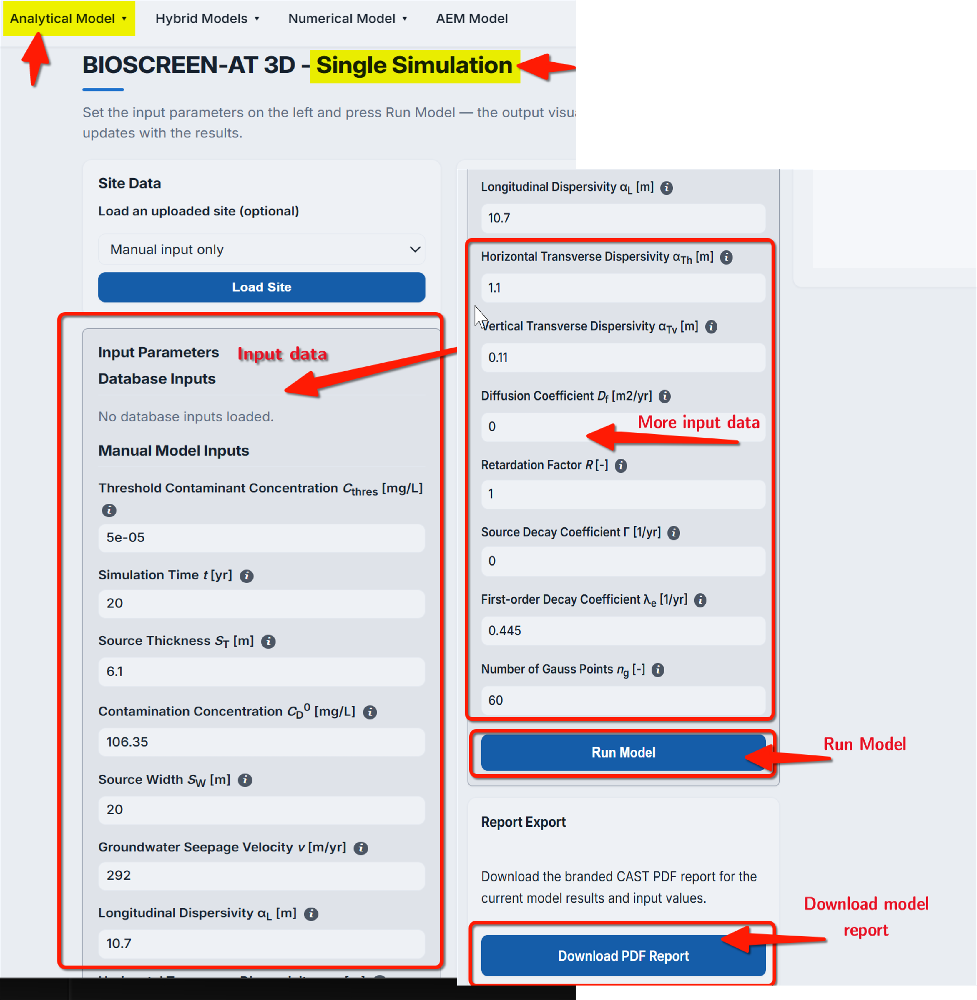
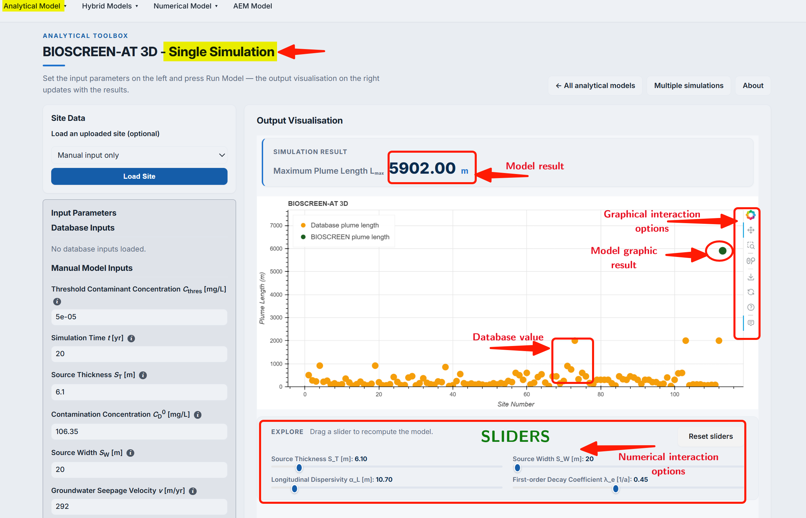
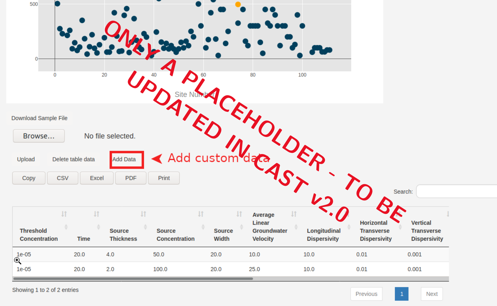
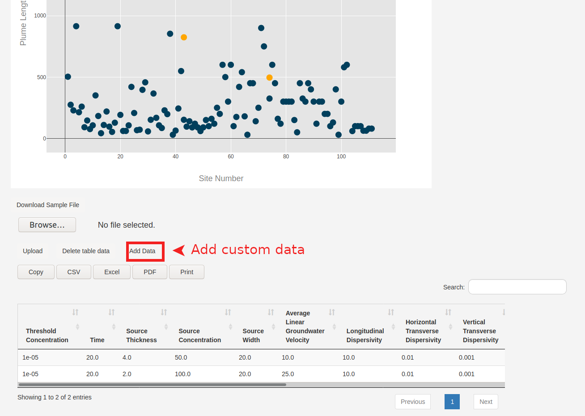

## Model description

The BIOSCREEN-AT, provided in @karanovic2007 model provides an exact analytical Solution to the BIOSCREEN Model. The model provides a 3D **transient** solution for transport of dissolved contaminants, incorporating several natural attenuation processes both at the source and the plume. As shown in @fig-fig3.6-i, the source is given as a patch specified-concentration boundary condition.


::: {#fig-fig3.6-i}

{
width="80%" 
height="350px" 
fig-align="center" 
fig-alt="Screenshot of BIOSCREEN-AT-conceptual setup"}

BIOSCREEN-AT: conceptual setup

:::


Karanovic et al. (2007) Provide the following expression for an exact analytical solution:


$$
c(x,y,z, t) = C_0 \frac{x}{8\sqrt{\pi D_x'}}\exp(-\Gamma t)\times\\
\times \int\limits_0^t\frac{1}{\xi^{3/2}}\exp\Bigg\{(\Gamma-\lambda_{e})\xi- \frac{(x-v'\xi)^2}{4D_x'\xi}\Bigg\}\times\\
\times\Bigg[\text{erfc}\Bigg\{\frac{y-\frac{W_s}{2}}{2\sqrt{D_y'\xi}}
\Bigg\}-\text{erfc}\Bigg\{\frac{y+\frac{W_s}{2}}{2\sqrt{D_y'\xi}}
\Bigg\}\Bigg]\times \\
\times \Bigg[\text{erfc}\Bigg\{\frac{z-T_s}{2\sqrt{D_z'\xi}}\Bigg\}-
\text{erfc}\Bigg\{\frac{z+T_s}{2\sqrt{D_z'\xi}} 
\Bigg\}\Bigg]\text{d}\xi
$$ {#eq-eqbio2007} 

**ANTON Pls. ADD UNITS**

::: {.column-margin}
**with symbols:**

$c_0$ = initial source concentration (mg/L)<br/>
$D'x$ = dispersion coefficient divided by retardation ($R$) factor $D_x/R$<br/>
$D'y$ = dispersion coefficient divided by retardation factor $D_y/R$<br/>
$D'z$ = dispersion coefficient divided by retardation factor $D_z/R$<br/>
$\Gamma$ = source decay coefficient <br/>
$\lambda_{e}$ = effective first order decay coefficient<br/>
$W_s$ = source width (m)<br/>
$T_s$ = source depth (m)
:::

## Model assumptions

The model is based on the following assumptions: 

1. Aquifer extends `semi-infinite` in $x$-direction, infinite in $y$-direction and extends from water table to relatively `large` depth.
2. Groundwater flow is steady and one dimensional in an homogeneous aquifer
3. The solute undergoes `equilibrium sorption` and `first-order` transformation reactions.
4. $L_{max}$ is always found on the center line.

## Model parameters

`Threshold Concentration`- The evaluation of the analytical solution shows, that the contaminant concentration $C \to 0$ for $x \to \infty$. Due to this asymptotical convergence, it is required to provide a threshold concentration, which defines the $L_{max}$ concentration contour level. This threshold should be close to a concentration of 0 or one could also choose value equaling water quality standards. The default value in PACS is set at $5e-5$ mg/l.

`Time` - The BIOSCREEN analytical solution is a `transient solution`, which means that the state of the contaminant plume is dependent of time. The interaction of plume growing effects and attenuation processes will often result in a state of equilibrium in which the plume keeps a constant size. It is not possible to define a global valid period after which a steady-state is reached, since this dependes heavily on the hydrogeologic conditions. However, a simple approximation can be used based on the decay within the plume $t=\frac{1}{\Lambda}+5$ [y]. But it is important to note that this approach does **not** guarantee the steady-state of the plume. It is therefore recommended to use a value of at least 20 years (default value).  

`Longitudinal Dispersivity` - is an aquifer parameter which effects the intensity of mixing in the liquid phase along the $x$-axis. The default value used in PACS is 10 m.  

`Horizontal Transverse Dispersivity` - effects the mixing intensity of the liquid phase along the $y$-axis. The default value is 1 m  

`Vertical Transverse Dispersivity` - effects the mixing intensity of the liquid phase along the $z$-axis. The default value is 0.1 m.  

`Effective Diffusion Coefficient` - this parameter defines particle movement and therefore the effect of plume growth based on Brownian molecular motion. For most scenarios it has a negligible role. But for cases with very low groundwater velocities and long time periods it gains on impact on the result.  

`Retardation Factor` - the ratardation factor quantifies natural attenuation processes such as adsorption and desorption of particles over time in the soil matrix. Very high ratardation factors result in smaller plumes due to stronger attenuation of the contamination.  

`Source Decay Coefficient` - describes the degredation of the source and therefore the decrease of the contaminant concentration within the source. This can be the result of biological degredation of the contaminant or other forms of decay. 

`Decay Coefficient` - $\Lambda$ describes the decay of the contaminant within the plume. It occurs due to the same reasons as the source decay, but in addition a stronger degredation comes from oxidation and chemical reactions with other chemical compounds that are available.  

## Solution approach for BIOSCREEN-AT in PACS

The concentration contour for BIOSCREEN-AT (eq. @eq-eqbio2007) includes an integral that has to be numerically solved for obtaining $L_{max}$. The $L_{max}$ in this case is the  _centereline_ maximum longitudinal extend of the selected threshold concentration contour. 

PACS uses [Gauss-Legendre Quadrature](https://en.wikipedia.org/wiki/Gauss%E2%80%93Legendre_quadrature) to solve for $C(x,y,z)$ using eq. @eq-eqbio2007. The Gauss-Legendre Quadrature method requires specifying the number of sample points (called Gauss points), based on which corresponding specific weights are obtained. The weights are then used to obtain the solution. Generally, higher the Gauss points, the higher the accuracy of the solution. However, higher sample points also means a large number of computations. In PACS Python codes are developed  very identical to the  FORTRAN code provided in @karanovic2007 to solve @eq-eqbio2007) (using Gauss-Legendre Quadrature method). Python library [Scipy](https://docs.scipy.org/doc/scipy/reference/special.html) provides functions for obtaining the roots and weights required by the Gauss-Legendre Quadrature method. 

::: {.callout-note collapse="true" title="Python code for obtaining the Gauss-Legendre roots and weights"}
```python
roots = sp.special.roots_legendre(m)[0]
weights = sp.special.roots_legendre(m)[1]
```
:::


Following the approach provided in @karanovic2007 the limits of integration of eq. @eq-eqbio2007 is scaled. This is required for speeding up the computation. The codes used in PACS for this purpose can be seen by clicking the _dropdown_ button

::: {.callout-note collapse="true" title="Python code for scaling the limits of integration"}
```python
        #scaling of the integration limits for faster computation
    
        bot = 0
        top = np.sqrt(np.sqrt(t))
    
        Tau = (roots*(top-bot)+top+bot)/2
        Tau4= Tau**4
```
:::

Eq. @eq-eqbio2007 provides the solution for $C(x,y,z)$, i.e., concentration isosurface. However, we intend to find $L_{max}$, which is a centreline maximum longitudinal distance of the specificed threshold concentration. Thus, to obtain only $L_{max}$ we fix the domain (based on @karanovic2007 ) as follows:

```python
        # Fixing domain boundary to obtain Lmax
        
    if x<=1e-6:
        if y <= W/2 and y >= -W/2 and z <= z_2 and z >= z_1:
            C=Co*np.exp(-ga*t)
        else:
            C=0
    else:
        
        a = Co*np.exp(-ga*t)*x/(8*np.sqrt(np.pi*Dxr))
    
```

After completion the above steps, i.e., transformation of limits and scaling of the domain, inetegral in eq. @eq-eqbio2007 is evaluated using the following Python code. 

```python

    # evaluating the integrand and summing
       
    xTerm = (np.exp(-(((la-ga)*Tau4)+((x-vr*Tau4)**2)/(4*Dxr*Tau4))))/(Tau**3)
    
    yTerm = sp.special.erfc((y-W/2)/(2*np.sqrt(Dyr*Tau4))) - sp.special.erfc((y+W/2)/(2*np.sqrt(Dyr*Tau4)))
    
    zTerm = sp.special.erfc((z-z_2)/(2*np.sqrt(Dzr*Tau4))) - sp.special.erfc((z-z_1)/(2*np.sqrt(Dzr*Tau4)))
    
    Term = xTerm * yTerm * zTerm
    
    Integrand = Term*(weights*(top-bot)/2)
    
    C = a*4*sum(Integrand)
        
```
The required $L_{max}$ is then found by implementing a loop to identify the location at wihch the threshold concentration falls below the defined limit.


After evaluating the numerical Integration, the value for Lmax is found by 
For that reason the roots and their specific weights of the Legendre polynomial up to a value of "m" are genereated as shown below, where the value of m is typically 60.

::: {.callout-important title="Number of Gauss Points"}

Number of Gauss points required in computation can be any number. However using 60 is recommended as quite a high level of accuracy can be quickly obtained. This is particularly important for **online** version of PACS. For the **offline** version of PACS >104 is recommended.

Using Gauss points $<15$ is not recommended.

:::

## Model results using PACS

The PACS interface of BIOSCREEN-AT is identical to that for other analytical/empirical models. The details of the interface and available user options can be found at [Liedl et al. (2005)](liedl2005.qmd). Below a very brief outline of the PACS interface specific to BIOSCREEN-AT is provided.


***Single computing simulation***

First all input data needs to be defined (screenshot @fig-fig3.6-ii). It has to be noted that BIOSCREEN-AT requires significantly higher number of input parameters due to multiple processes considered in the model.
Then a graph is genereated, that shows the result of the computation in comparison to the field data from the PACS database (screenshot @fig-fig3.6-iii).

::: {#fig-fig3.6-ii}

{
width="80%" 
height="350px" 
fig-align="center" 
fig-alt="Screenshot of BIOSCREEN-AT-data input interface"}

BIOSCREEN-AT: data input interface

:::

::: {#fig-fig3.6-iii}

{
width="80%" 
height="350px" 
fig-align="center" 
fig-alt="Screenshot of BIOSCREEN-AT-result interface for single computing"}

BIOSCREEN-AT: result interface for single computing

:::


Once the first computation of $L_{max}$ pressing `Run Model` button is made, the PACS interface provides interface with **sliders** bars (@fig-fig3.6-iv) for the most sensible model parameters.

::: {#fig-fig3.6-iv}

{
width="80%" 
height="350px" 
fig-align="center" 
fig-alt="Screenshot of BIOSCREEN-AT-interactive options for exploring result"}

BIOSCREEN-AT: interactive options for exploring result

:::


The **sliders** can be used to change the input values while simultaneously getting a feedback of how these changes effect the model result. This has the advantage that it is not required to generate a new graph which makes the effect of the parameter change more visible and clear.

::: {.callout-caution}

Numerical computations are used to compute $L_{max}$. As such care has to be taken while changing slider values. Long computation time may be required before the solution is obtained.

:::

***Multiple computing simulation***

The multiple computing mode can be used to visualize different own case results in one graph, while still being able to compare to the PACS database. The interface for BIOSCREEN-AT is identical to other models. User can check  [Liedl et al. (2005)](liedl2005.qmd) on details of using the **multiple computing interface**.

Data in the interface can be inserted via the `add data` button or can be uploaded from a file (@fig-fig3.6-v). A sample file can be downloaded for purposes of correct formatting. It is possible to slect the desired sites to be schown in the graph. 

::: {#fig-fig3.6-v}

{
width="80%" 
height="350px" 
fig-align="center" 
fig-alt="Screenshot of BIOSCREEN-AT-Multiple computing interface"}

BIOSCREEN-AT: Multiple computing interface

:::
