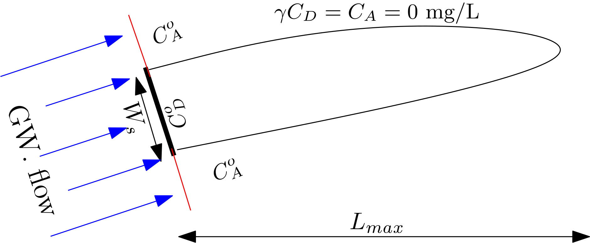

## Model description

@chu2005 is 2D horizontal model and provides an estimate of a steady-state plume length ($L_{max}$) and investigates the large-time solution behavior of a representative bio-reactive transport model under the conditions that the mixing of two required substrate occurs only in the directions transverse to groundwater flow.

::: {#fig-fig3.3-i}

{
width = "80%"
height = "400px"
fig-align="center" 
fig-alt="Conceptual setup of Chu2005 model"}

@chu2005: Conceptual setup

:::

@chu2005 provides the following explicit expression for $L_{max}$:

$$
L_{max} = \frac{\pi}{16}\frac{W_s^2}{\alpha_{Th}}\bigg(\frac{\gamma C_{ED}^\circ}{C_{EA}^\circ+\epsilon}\bigg)^2
$$

::: {.column-margin}
**Symbols:**

$W_s$ = Source width [L] 
$\alpha_{Th}$ = Horizontal transverse dispersivity [L] 
$\gamma$ = Reaction stoichiometric ratio [ ] 
$C_{D}^\circ$ = Contaminant (Electron Donor) concentration [ML$^{-3}$] 
$C_{A}^\circ$ = Partner reactant (Electron Acceptor) concentration [ML$^{-3}$] 
$\epsilon$ = Biological concentration factor [ML$^{-3}$]

:::

**The model is based on the following assumptions:**

1. There is a continuous `line` source of contaminant and `instantaneous` reaction active in the domain.
2. A dissolved contaminant is assumed to be biodegraded only at plume `fringe` because of transverse mixing but not inside the plume.
3. The domain in homogeneous, isotropic and fully saturated.

## Using Chu et al. (2005) model in PACS

***Single computing interface***

The PACS user-interface for all the analytical models are identical. This is true for both single computing interface and multiple simulation interface. The identical interface simplifies the use of models in the PACS. Therefore, the extensive details on using the Liedl et al. (2005) model in PACS provided [here](liedl2005.qmd) can be used also for the @chu2005.

The only differences in each model interface are the model specific parameters. This can be observed in the below screenshot (@fig-fig3.3-ii) of the interface of the @chu2005 model: 

::: {#fig-fig3.3-ii}

- input parameters"){
width="80%" 
height="350px" 
fig-align="center" 
fig-alt="Screenshot of Chu2005-single simulation interface"}

@chu2005: Single computing interface

:::

Once the input data is placed in the box, user needs to click on the ``Run Model`` to get the result. Results are obtained as an _absolute number_ above the graph and also graphically (see @fig-fig3.3-iii), which provides the field plume length data from the database. This allows a visual comparison of the model $L_{max}$ with the field data.

As explained in detail in the use of [Liedl et al. (2005)](liedl2005.qmd) model, the resulting graph provides several interactive options to evaluate results. The screenshot below provides the output of the single computing mode of PACS.

::: {#fig-fig3.3-iii}

- Interactive options to evaluate results"){
width="80%" 
height="350px" 
fig-align="center" 
fig-alt="Screenshot of Chu2005-Interactive options to evaluate results"}

@chu2005: Interactive options to evaluate results

:::

***Dynamically comparing model results using sliders***

**Sliders** are activated once the ``Run Model`` is clicked. Sliders are provided for critical model parameters only. These changes the model input parameters; for which the output $L_{max}$ appears interactively in the graph. This enables a dynamic computation and visualization. 

***Multiple computing interface***

The multiple computing interface of the @chu2005 model is identical to [Liedl et al. (2005)](liedl2005.qmd) model interface. The goal of the multiple computing interface  is to develop several scenarios and compare the output of these scenarios with that of the field data. As can be observed in the screenshot below (@fig-fig3.3-iv), users have an option to select the site(s) they would like to compare their with.

::: {#fig-fig3.3-iv}

- Site selection options in the multiple computing interface"){
width="80%" 
height="350px" 
fig-align="center" 
fig-alt="Screenshot of Chu2005-Site selection options in the multiple computing interface"}

@chu2005: Site selection options in the multiple computing interface

:::

The interface of multiple computing interface is provided in the screenshot below (@fig-fig3.3-v). Details on the options are identical to that provided for [Liedl et al. (2005)](liedl2005.qmd). The screenshot clarifies the available options.

::: {#fig-fig3.3-v}

- Options for downloading and reusing results"){
width="80%" 
height="350px" 
fig-align="center" 
fig-alt="Screenshot of Chu2005-Options for downloading and reusing results"}

@chu2005: Options for downloading and reusing results

:::

