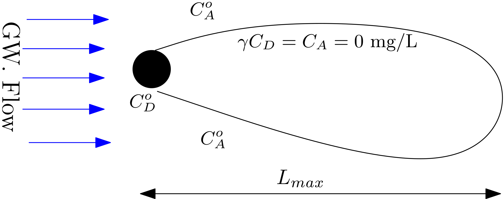
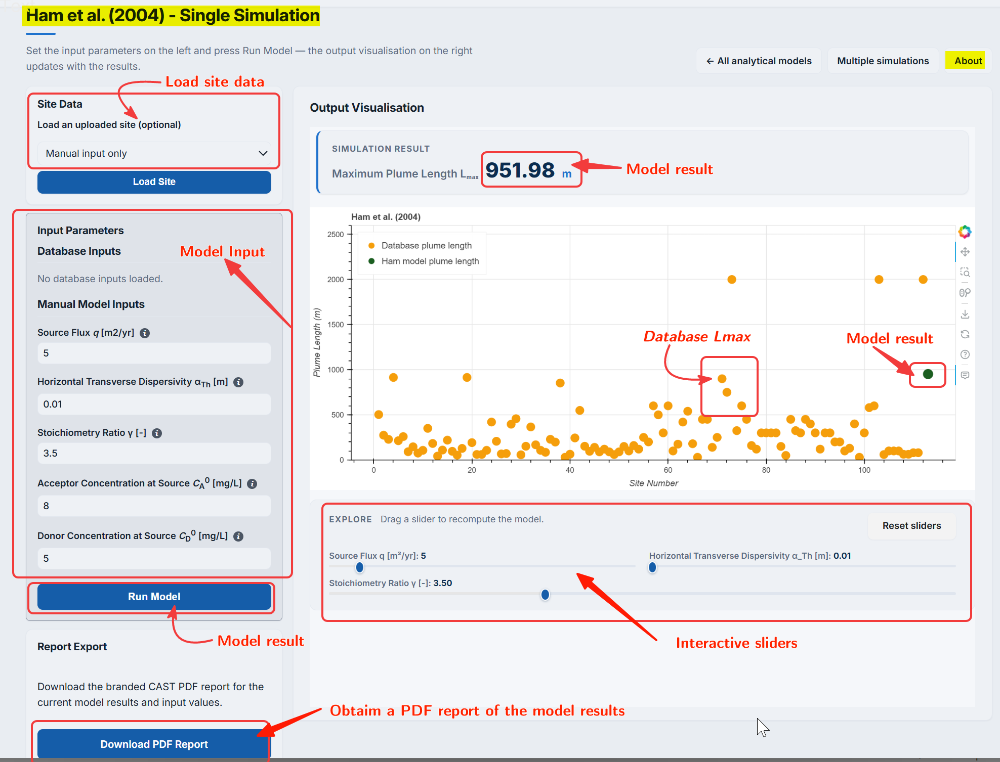
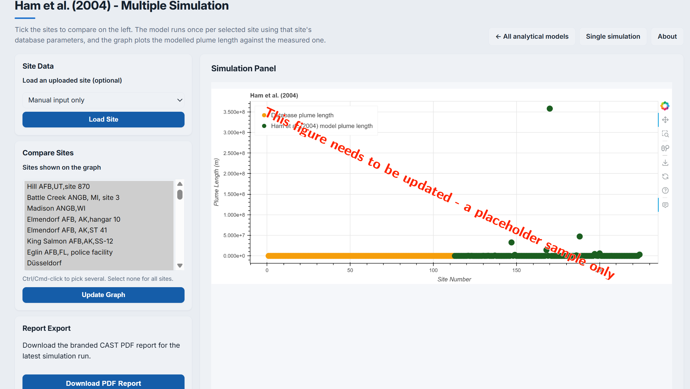

## Model description ##

@ham2004 is 2D horizontal model and provides an estimate of a steady-state plume length ($L_{max}$) using a point source. Ádditionally, the model explores the effects of longitudinal and transverse dispersivity on the steady state plume length.

::: {#fig-fig3.2-i}

{
fig-align="center" 
fig-alt="Conceptual setup of @ham2004 model"}

@ham2004: Conceptual setup

:::

Ham et al. (2004) provides the following explicit expression for $L_{max}$:
$$
L_{max} = \frac{1}{4\pi}\frac{W_e^2}{\alpha_{TH}}\bigg(\frac{\gamma C_{ED}^\circ}{C_{EA}^\circ}\bigg)^2
$$

::: {.column-margin}
**Symbols**

$W_e$ = Effective flow Width [L] 
$\alpha_{Th}$ = Horizontal transverse Dispersivity [L] 
$\gamma$ = Reaction stoichiometric ratio [ ] 
$C_{D}^\circ$ = Contaminant (Electron Donor) concentration [ML$^{-3}$] 
$C_{A}^\circ$ = Partner Reactant (Electron Acceptor) concentration [ML$^{-3}$] 
:::

**The model is based on the following assumptions:**

1. A `point` source with constant mass flow injection.
2. An `instantaneous` reaction between an injected compound and a reactant in the ambient groundwater at the plume fringe.
3. The domain in homogeneous, isotropic and fully saturated.

## Using Ham et al. (2004) model in PACS

***Single computing interface***

The PACS user-interface for all analytical models are identical for both single computing interface and multiple simulation interfaces. This simplifies the use of models in the PACS. Therefore, the extensive details on using the @liedl2005 model in PACS provided [here](liedl2005.qmd) can also be used also for the @ham2004 model.

The only differences in each model interface are the model specific parameters. This can be observed in the below screenshot of the interface of the @ham2004 model: 

::: {#fig-fig3.2-ii}

{
width="80%" 
height="350px" 
fig-align="center" 
fig-alt="Screenshot of Ham2004-single simulation interface"}

@ham2004: Single computing interface

:::

Once the input data is placed in the box, clicking on the ``Run Model`` will produce the result. The numerical result is provided above the generate graph and also graphically, which also provides the field plume length data ($L_{max}$) from the database. This allows a visual comparison of the model $L_{max}$ with that of the field data.

As explained in detail in [@liedl2005](liedl2005.qmd) model , the resulting graph provides several interactive options, e.g., `sliders` to re-evaluate results. 

***Dynamically comparing model results using sliders***

**Sliders** are activated once the ``Run Model`` is clicked. Sliders are provided for critical model parameters only. These changes the model input parameters; for which the output $L_{max}$ appears interactively in the graph. This enables a dynamic computation and visualization. 

***Multiple computing interface***

::: {#fig-fig3.2-iii}

{
width="80%" 
height="350px" 
fig-align="center" 
fig-alt="Screenshot of Ham2004 - Multiple simulation interface"}

@ham2004: Multiple computing interface

:::

The multiple computing interface of the @ham2004 model (@fig-fig3.2-iii) is identical to that [Liedl et al. (2005)](liedl2005.qmd) model interface. The goal of the multiple computing interface  is to develop several scenarios and compare the output of these scenarios with that of the field data. As can be observed in the screenshot below, users have an option to select the site(s) they would like to compare their scenarios with.

The obtained results along with the input data and plots can be obtained as a `PDF` report by clicking the `Download PDF report` button (see @fig-fig3.2-iii )

