# i. Liedl et al. (2005) Model {.unnumbered}

## Model description {#des_li2005}

This model, based on [Liedl et al. (2005)](refli2005), provides an estimate of a steady-state plume length ($L_{max}$ ) from a vertically oriented 2D model domain (see @fig-3-i-01). The vertical orientation refers to $z$-axis being aligned to the aquifer thickness.

{#fig-3-i-01 fig-align="center" width="40%"}

[Liedl et al. (2005)](refli2005) provides the following explicit expression for $L_{max}$:

$$
L_{max} = \frac{4}{\pi^2}\frac{M^2}{\alpha_{Tv}}\ln\bigg(\frac{4}{\pi}\frac{\gamma C_{ED}^\circ + C_{EA}^\circ }{C_{EA}^\circ}\bigg)
$$

::: {.column-margin}
**in which:**

$M$ = Source Thickness [L], which is equal to Aquifer thickness ($A_t$) [L] 
$\alpha_{Tv}$ = Vertical Transverse Dispersivity [L] 
$\gamma$ = Reaction stoichiometric ratio [ ] 
$C_{ED}^\circ$ = Contaminant (Electron Donor) concentration [ML$^{-3}$] 
$C_{EA}^\circ$ = Partner Reactant (Electron Acceptor) concentration [ML$^{-3}$]
:::

**The model is based on the following assumptions:**

1. Steady-state condition in a homogeneous and isotropic aquifer.
2. A single step bi-molecular instantaneous reaction between reactants taking place only at the fringe.
3. The contaminant source (Electron Donor) penetrates entire thickness of the aquifer.
 

## Using Liedl et al. (2005) model in CAST

Clicking the **Analytical Toolbox** box in the homepage will lead to the interface that lists (@fig-3-i-02) all the analytical models available in the CAST. To use the Liedl et al. (2005) model. From the interface, please click on the option **`Click here to see the model`** below the Liedl et al. (2005) as shown on the  screenshot (@fig-3-i-02).

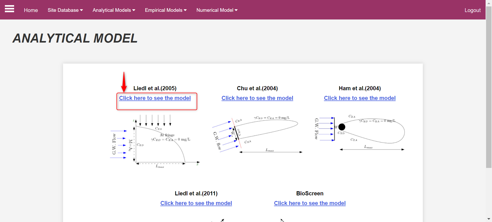{#fig-3-i-02 fig-align="center" width="50%"}

By doing so, you will be directed to this page, which contains a brief description of this model - as is provided [here](des_li2005). The screenshot below (@fig-3-i-03) shows the interface

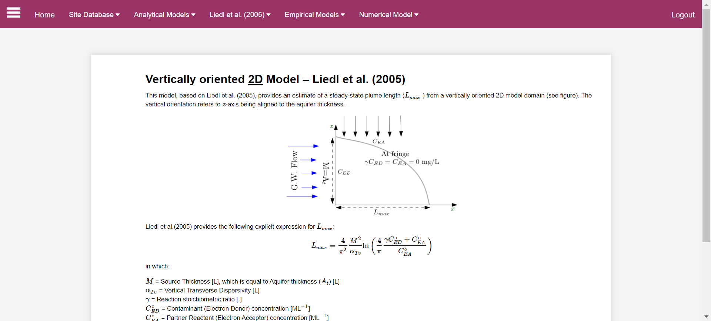{#fig-3-i-03 fig-align="center" width="40%"}

Please click on option **Liedl et al. (2005)**, located in the _top_ bar, to open the dropdown menu containing the **two** options for computation (see @fig-3-i-04).
In case a user wishes to model a single site or a number of sites but one at a time **`Single computing simulation`** option can be used. And if the number of sites is more than one or a user wishes to model the several sites or scenarios at once, then **`Multiple computing simulation`** option can be used. 

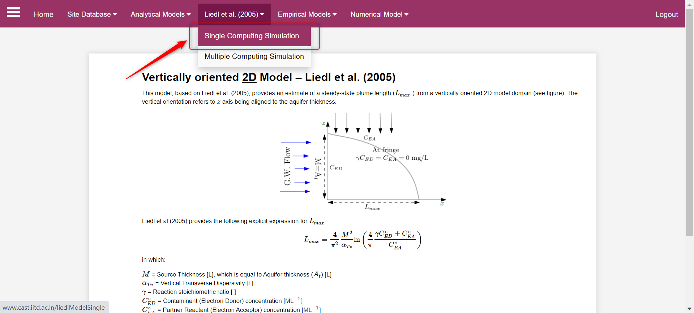{#fig-3-i-04 fig-align="center" width="40%"}

***Using Single Computing Model of Liedl et al. (2005) in CAST***

The **single computing simulation** interface is activated when it is clicked, as in the screenshot @fig-3-i-05.

After clicking on **`single computing simulation`**, you will be directed towards the below attached window (@fig-3-i-05). The area highlighted in red square in @fig-3-i-05 contains the _input_ parameters for the model which are briefly defined below:

**`Thickness` ($M$):** refers to the aquifer thickness (in m). In [Liedl et al. (2005)](refli2005) $M$ is the most sensitive quantity affecting $L_{max}$  

**`Dispersivity`** ($\alpha_{TV}$): refers to the transverse vertical dispersivity (in m). It affects the mixing intensity of the liquid phase along the vertical axis. This is a highly sensitive parameter, with strong impact on the $L_{max}$.

**`Stoichiometric Ratio`** ($\gamma$): is unitless parameter dependent on the contaminant compound and its reaction partner. 

**`Electron Donor`** ($C_{ED}$):refers to the contaminant source concentration (in mg/l).

**`Electron Acceptor`** ($C_{EA}$): refers to the concentration of the dominating reactant e.g., Oxygen (mg/l).

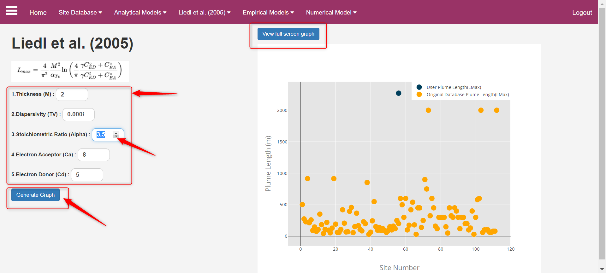{#fig-3-i-05 fig-align="center" width="40%"}

In order to change the values of any of the input parameters, please move your cursor next to the data entry fields and use navigator arrows to increase or decrease the value (see @fig-3-i-05). You can also directly enter the required value in the field.
Finally, when you have defined the input parameters as per your requirement, please click on the **`Generate Graph`** option.
By doing so, the system will generate a new graph that includes the new $L_{max}$ based on the newly defined parameters. Also, the system provides the value of $L_{max}$  at the bottom as shown in the screenshot @fig-3-i-05.

After the firs computation and graph generated, an interactive _sliders_ appears in the interface (see @fig-3-i-06). These slider can be used for changing the values of  **`Thickness`** and **`Dispersivity`** that appear below the **`Maximum Plume Length`**,as shown in the above screenshot @fig-3-i-05, to see how the $L_{max}$ changes upon changing these parameters.

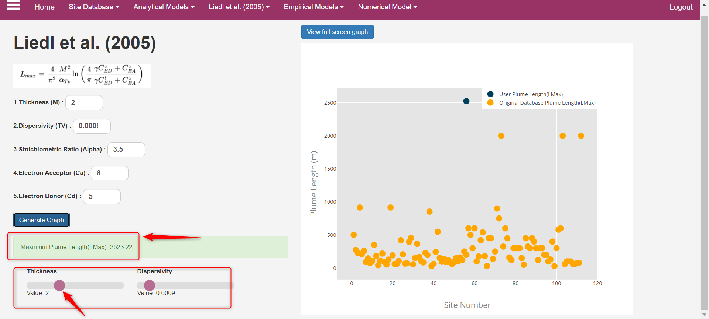{#fig-3-i-06 fig-align="center" width="40%"}

::: {.callout-important}
The sliders will only appear after the first computation is made.
:::
In case you wish to see the graph on _Fullscreen_ mode, please click on the button **`view full screen graph`**.

Moving your cursor to the top right corner of the generated **graph** will reveal the advanced options bar (see @fig-3-i-07). These options enable you to download/export and interact with the graph.

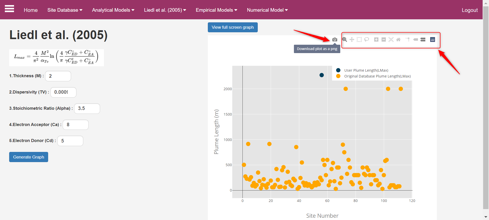{#fig-3-i-07 fig-align="center" width="40%"}

The interactive options available with graphs are:
`Zoom`, `Pan`,`Box Select`, `Lasso Select`, `Zoom in_ and _Zoom out`, `Auto scale`, `Reset Axes`, `Toggle spike lines`, `Show closest data on hover`, and `Compare data on hover`.

***Using Multiple Computing Simulation for Liedl et al. (2005) model***

**`Multiple computing mode`** is suitable for _scenario based modeling._ In this one can create several scenarios by changing model input parameters and obtain $L_{max}$ for all scenarios at ones. This helps comparing between different created scenarios.    

Now, in case a user wants to use the **`Multiple Computing Simulation`**, one need to click on the option, located in top bar, as seen in @fig-3-i-08.

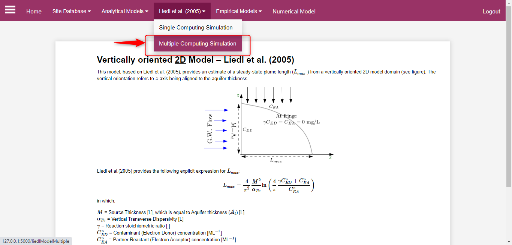{#fig-3-i-08 fig-align="center" width="40%"}

By doing so, you will be directed to this screen where you can select/upload multiple sites for your analysis. 
You can select sites from the already existing _dataset_ for which please click on **`All sites button`**, as seen in @fig-3-i-09. Upon clicking, a dropdown will appear which contains a list of sites. To select the sites, please select the **`checkboxes`** adjacent to the site names, as seen in screenshot @fig-3-i-10.

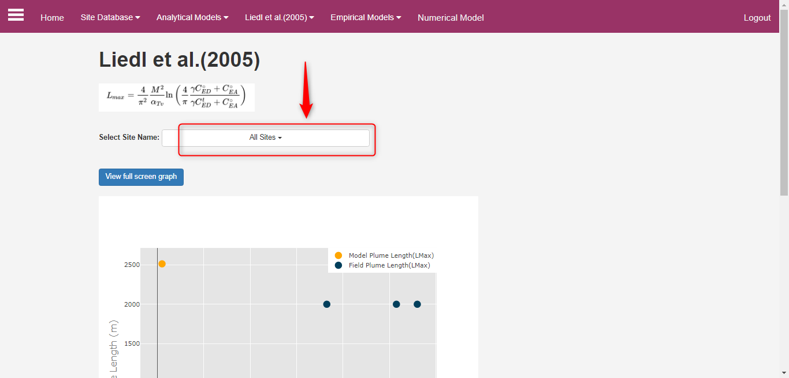{#fig-3-i-09 fig-align="center" width="40%"}

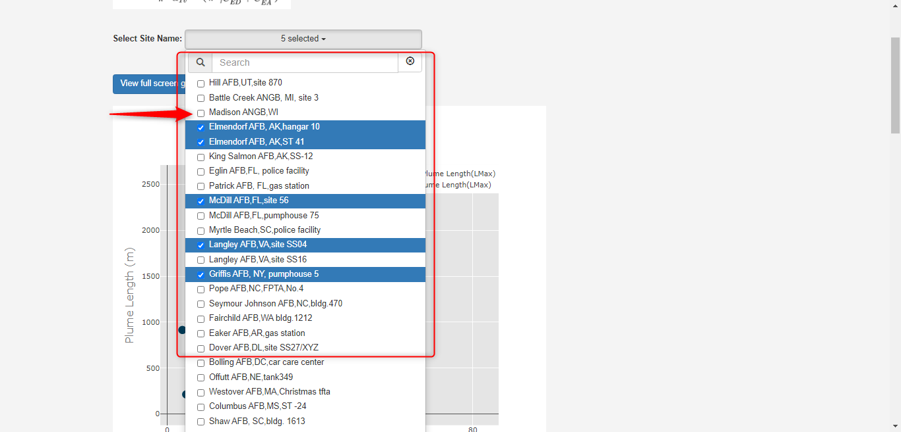{#fig-3-i-10 fig-align="center" width="40%"}

***Creating multiple scenarios—offline mode***

You can also _upload_ your own site dataset for which you have to first download _the data template_ file (a _.csv_ file). For this first you need to download the sample by clicking at **`Download Sample File`** (see @fig-3-i-11).  Please download the _.csv_ file and fill your data as you wish. The filling of data or creating of scenario can be done while being _offline._

::: {.callout-warning}
Do not change the heading name used in sample file.
:::
Once your data _.csv_ is ready, click on **`Choose File`** option, a search and select window will appear from where you can select your required file and finally click on **open** button to select it. After you have selected you file, _the file name_ will appear next to **`Choose File`** button. Next, please click on **`Upload`** button as shown on @fig-3-i-11, and based on the parameters defined in your file, system will generate the $L_{max}$ results on screen.

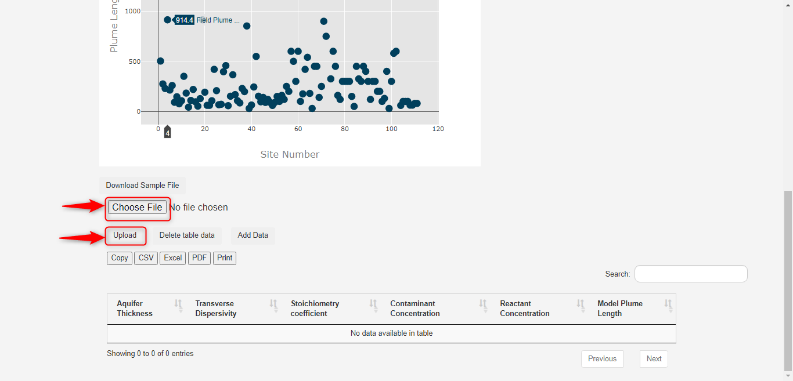{#fig-3-i-11 fig-align="center" width="40%"}

The user needs to make sure that the file is in the format of the sample dataset. In such cases and in the case where the range or values of parameters don’t match the permitted, system will display an error message (see @fig-3-i-12). You are requested to rectify all the issues before uploading again.

::: {.callout-important}
The online version of CAST has restricted parameter range. This is required to ensure that calculation and results are displayed with available internet requirements

For the offline version, the range can be set by user themselves.
:::

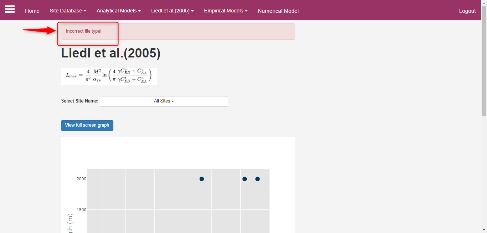{#fig-3-i-12 fig-align="center" width="40%"}

***Creating multiple scenarios—online mode***

For limited number of scenario data can be manually entered in the data table. This will require network connection for the online CAST. 
For addign data _manually,_ please click on the **`Add Data`** button as can be seen in screenshot @fig-3-i-13.

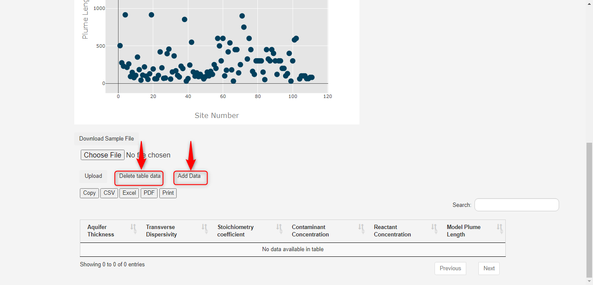{#fig-3-i-13 fig-align="center" width="40%"}

By doing so, new window will appear on screen, here you can enter you data manually into the **boxes** that appears, and after entering the data in all the fields, please click on the **`Generate Graph`** button to compute. @fig-3-i-14

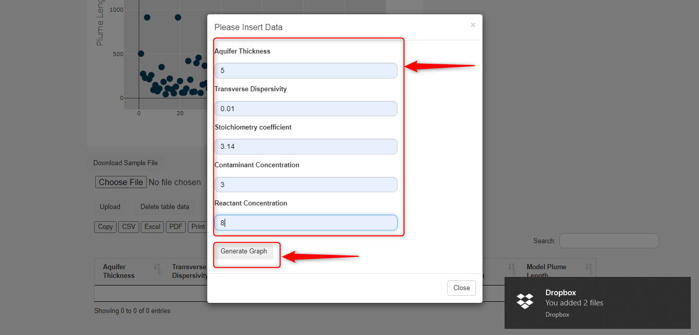{#fig-3-i-14 fig-align="center" width="40%"}

If the entered values are in permitted range, system will display a message, **your entry has been added**. And based on the parameters defined, system will generate a new result graph (see below @fig-3-i-15). In case you wish to **delete** your results and start from fresh, please click on **`delete table data`** button, as shown in @fig-3-i-13.

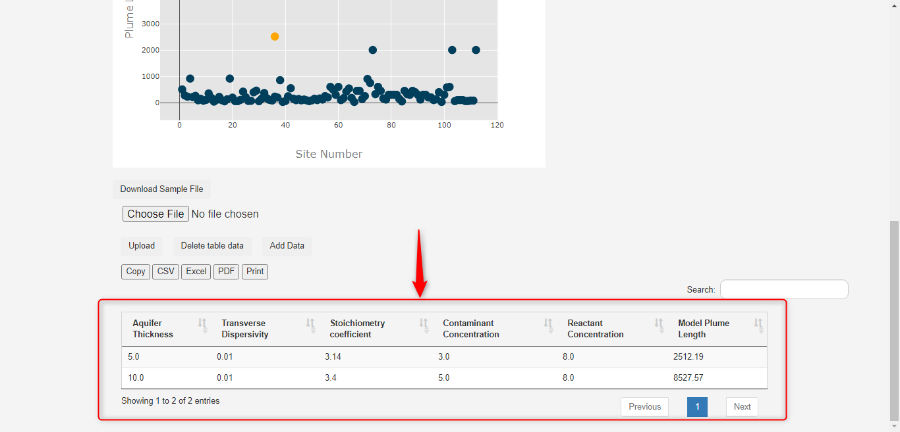{#fig-3-i-15 fig-align="center" width="40%"}

The results obtained can be download in three different formats, `.csv`, `.xls`, and `.pdf`. In case you want to print out of your results, please click on the **`print`** button, as shown on attached screenshot @fig-3-i-16.

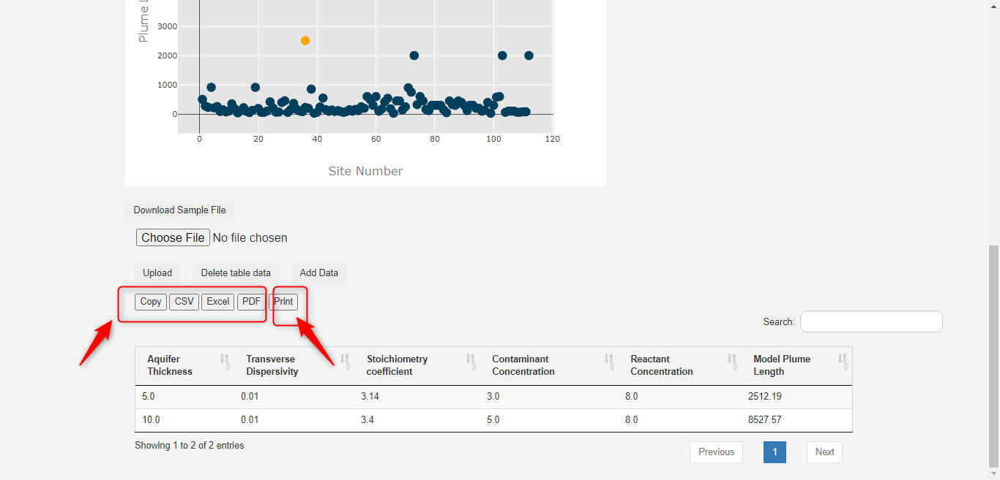{#fig-3-i-16 fig-align="center" width="40%"}

## Reference {#refli2005}
Liedl, R., Valocchi, A., Dietrich, P., Grathwohl, P., 2005. Finiteness of steady state plumes. Water Resour. Res. 41, W12501. https://doi.org/10.1029/2005WR004000

