## Model description {#des_li2005}

This model, based on @liedl2005, and can be used to estimate a steady-state plume length ($L_{max}$ ) from a vertically oriented 2D model domain (see @fig-fig3.1-i). The vertical orientation refers to $z$-(vertical) axis being aligned with the aquifer thickness.

::: {#fig-fig3.1-i}

{
width = "80%"
height = "400px"
fig-align="center" 
fig-alt="Conceptual setup of Liedl2005 model"}

@liedl2005: Conceptual setup

:::

@liedl2005 provides the following closed-form expression for the $L_{max}$:

$$
L_{max} = \frac{4}{\pi^2}\frac{T_s^2}{\alpha_{Tv}}\ln\bigg(\frac{4}{\pi}\frac{\gamma C_{ED}^\circ + C_{EA}^\circ }{C_{EA}^\circ}\bigg)
$$

::: {.column-margin}
**in which:**

$T_s$ = Source Thickness [L], which is equal to Aquifer thickness ($T_A$) [L] 
$\alpha_{Tv}$ = Vertical Transverse Dispersivity [L] 
$\gamma$ = Reaction stoichiometric ratio [ ] 
$C_{D}^\circ$ = Contaminant (Electron Donor) concentration [ML$^{-3}$] 
$C_{A}^\circ$ = Partner Reactant (Electron Acceptor) concentration [ML$^{-3}$]
:::

**The model is based on the following assumptions:**

1. `Steady-state` condition in a homogeneous and isotropic aquifer.
2. A single step bi-molecular `instantaneous reaction` between reactants taking place only at the fringe.
3. The contaminant source (Electron Donor) penetrates `entire thickness` of the aquifer.
 

## Using Liedl et al. (2005) model in PACS

Clicking the **Analytical Toolbox** box in the homepage will lead to the interface that lists (@fig-fig3.1-ii) all the analytical models available in the PACS. To use the @liedl2005 model. From that interface, please click on the option **`about`** in the  **Liedl et al (2005)** as shown on the  screenshot (@fig-fig3.1-ii).

::: {#fig-fig3.1-ii}

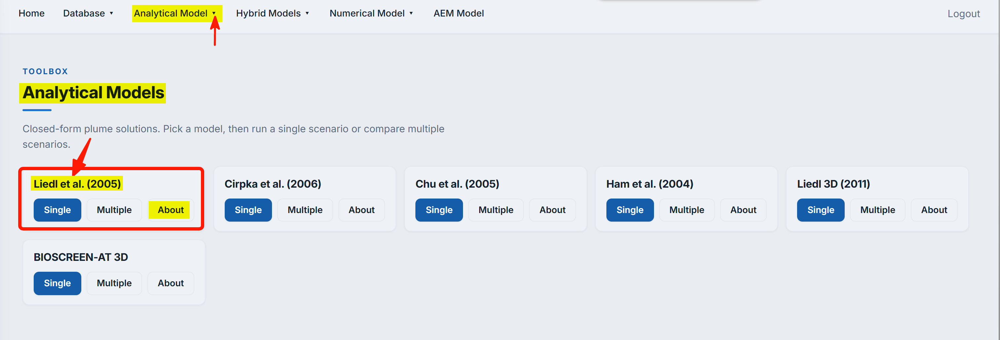{
fig-align="center" 
fig-alt="Screenshot of analytical model interface"}

Analytical model selection interface

:::

By doing so, you will be directed to this page, which contains a brief description of this model - as is provided in the paper @liedl2005. The screenshot below (@fig-fig3.1-iii) shows the interface

::: {#fig-fig3.1-iii}

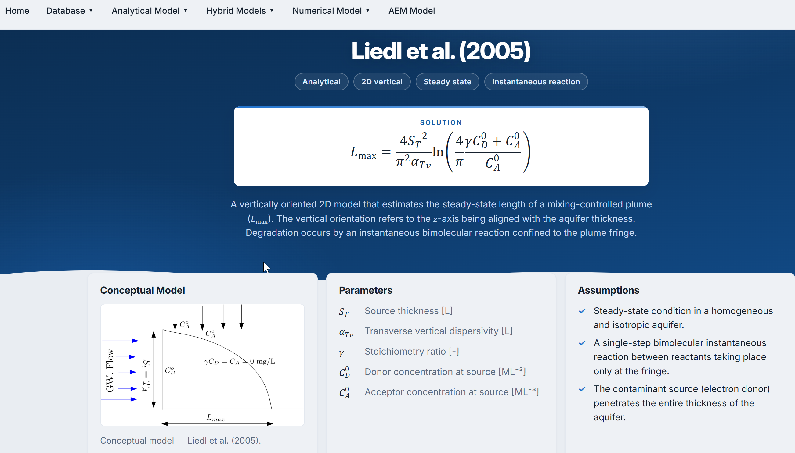{
fig-align="center" 
fig-alt="Screenshot of liedl2005-single simulation interface"}

@liedl2005: computing interface

:::

Click on option **Liedl et al. (2005)**, located in the _top_ menu bar (`Analytical Model`). The bottom of the newly opened page provides two options: **A.** `Run Single Scenario` and **B.** `Run Multiple Scenarios`
In case a user wishes to model a **single** site or a number of sites but one at a time **`Single computing simulation`** option can be used. And if the number of sites is more than one or a user wishes to model the several sites or scenarios at once, then **`Multiple computing simulation`** option can be used. 

::: {#fig-fig3.1-iv}

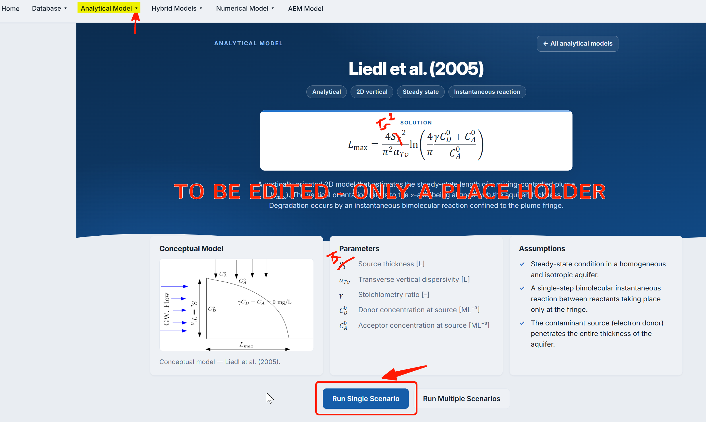{
aspect-ratio: "6/4"
fig-align="center" 
fig-alt="Screenshot of liedl2005- simulation interface options"}

@liedl2005: computing interface

:::

***Using Single Computing Model of Liedl et al. (2005) in PACS***

The **single computing simulation** interface is activated when it is clicked, bringing the interface as seen in @fig-fig3.1-v.

::: {#fig-fig3.1-v}

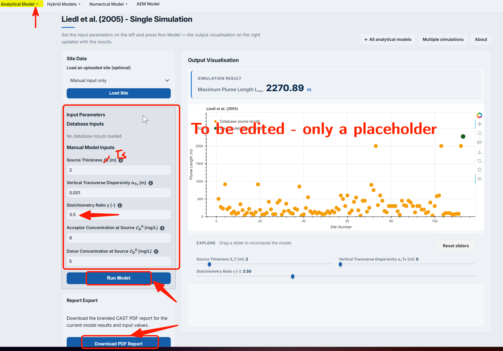{
width="80%" 
height="350px" 
fig-align="center" 
fig-alt="Screenshot of liedl2005-single simulation interface"}

@liedl2005: computing interface

:::

In the **`single computing simulation`** interface (@fig-fig3.1-v), the area highlighted in red square in contains the _input_ parameters for the model which are briefly defined below:

**`Thickness` ($T_s$):** refers to the aquifer thickness (in m). In @liedl2005 $T_s$ is the most sensitive quantity affecting $L_{max}$  

**`Dispersivity`** ($\alpha_{Tv}$): refers to the transverse vertical dispersivity (in m). It affects the mixing intensity of the liquid phase along the vertical axis. This is a highly sensitive parameter, with strong impact on the $L_{max}$.

**`Stoichiometric Ratio`** ($\gamma$): is unitless parameter dependent on the reaction between the contaminant compound and its reaction partner. 

**`Electron Donor`** ($C_{ED}$):refers to the contaminant source concentration (in mg/l).

**`Electron Acceptor`** ($C_{EA}$): refers to the concentration of the dominating reactant e.g., Oxygen (mg/l).

The input value in the interface (@fig-fig3.1-v) can be entered directly value in the selected input field.
Finally, when you have defined the input parameters as per your requirement, clicking on the **`Run Model`** will compute the $L_{max}$.\nabla

The system will generate a new graph that includes the new $L_{max}$ based on the newly defined parameters. Also, the system provides the value of $L_{max}$  at the **top** of the output graph as shown in the screenshot @fig-fig3.1-v.

After the firs computation and graph generated, an interactive _sliders_ in the interface can be used (see @fig-fig3.1-vi). These slider can be used for changing the values of  **`Thickness`** and **`Dispersivity`** that appear below the **`output graph`** (see @fig-fig3.1-v), and allows to see the change in $L_{max}$ upon changing these parameters values.

::: {#fig-fig3.1-vi}

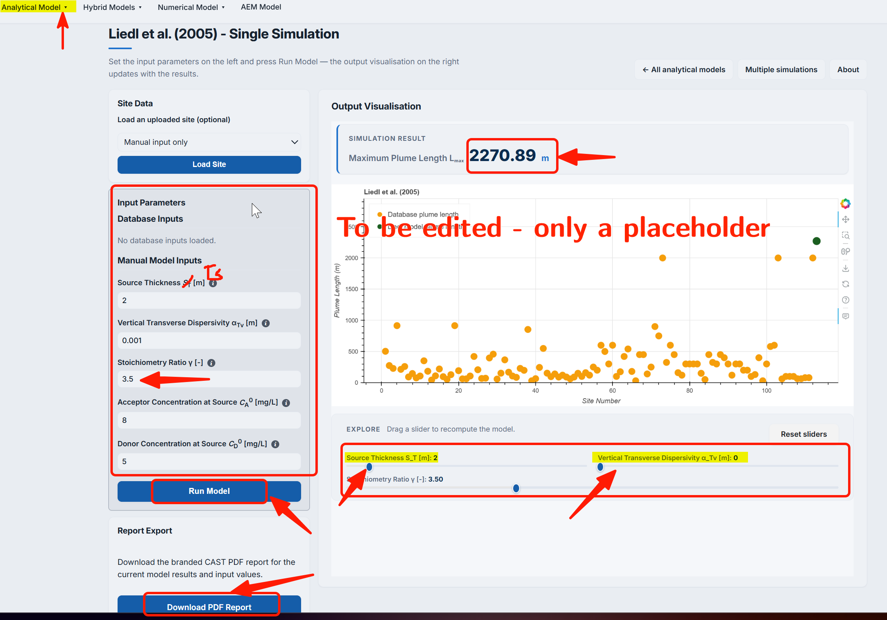{
width="80%" 
height="350px" 
fig-align="center" 
fig-alt="Screenshot of liedl2005-Interactive option in the single computing interface"}

@liedl2005: Interactive option in the single computing interface

:::

::: {.callout-important}
The `sliders` parameter provides limited parameter range.
:::

Moving the  cursor to the right corner of the generated **graph** will reveal the advanced options bar (see @fig-fig3.1-vii). These options enables to download/export and interact with the graph.

::: {#fig-fig3.1-vii}

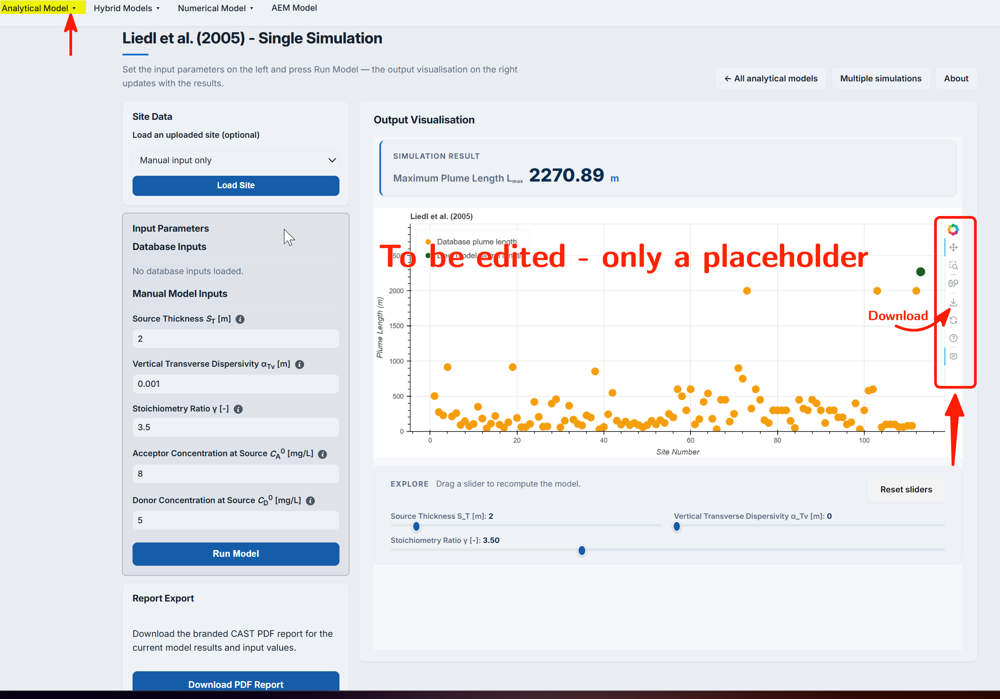{
width="80%" 
height="350px" 
fig-align="center" 
fig-alt="Screenshot of liedl2005 - Interactive option in the graph single computing interface"}

@liedl2005: Interactive option in the single computing interface

:::

Among the interactive options available with graphs are:
`Zoom`, `Pan`,`Box Select`, `Lasso Select`, `Zoom in_ and _Zoom out`, `Auto scale`, `Reset Axes`, `Toggle spike lines`, `Show closest data on hover`, and `Compare data on hover`.

***Using Multiple Computing Simulation for Liedl et al. (2005) model***

**`Multiple computing mode`** is suitable for _scenario based modeling._ In this one can create several scenarios by changing model input parameters and obtain $L_{max}$ for all scenarios at ones. This helps comparing between different created scenarios.    

For the **`Multiple Computing Simulation`**, one need to click on the `Analytical Model`, at the menu bar and select **Liedl et. al (2005)** model. This will show the interface shown in @fig-fig3.1-iv. The `Run Multiple Scenarios` can be selected from this interface. Alternatively, the **`Multiple Computing Simulation`** interface can also be reached from the **single scenario** interface (see @fig-fig3.1-v, above the **Output/Visualization** section of the interface)  

::: {#fig-fig3.1-viii}

{
width="80%" 
height="350px" 
fig-align="center" 
fig-alt="Screenshot of liedl2005 - Selecting Multiple Computing Simulation option"}

@liedl2005: Selecting Multiple Computing Simulation option

:::

The `Multiple Simulation Scenarios` interface allows to select/upload multiple sites for the analysis. 
You can select sites from the already existing _dataset_ for which please click on **`All sites button`**, as seen in @fig-fig3.1-ix. Upon clicking, a dropdown will appear which contains a list of sites. Select the slide by using mouse or by using keyboard `ctrl/cmd` and moving the mouse cursor. The selected sites are **higlighted**, as seen in screenshot @fig-fig3.1-x.

::: {#fig-fig-ix-x layout-ncol=2}

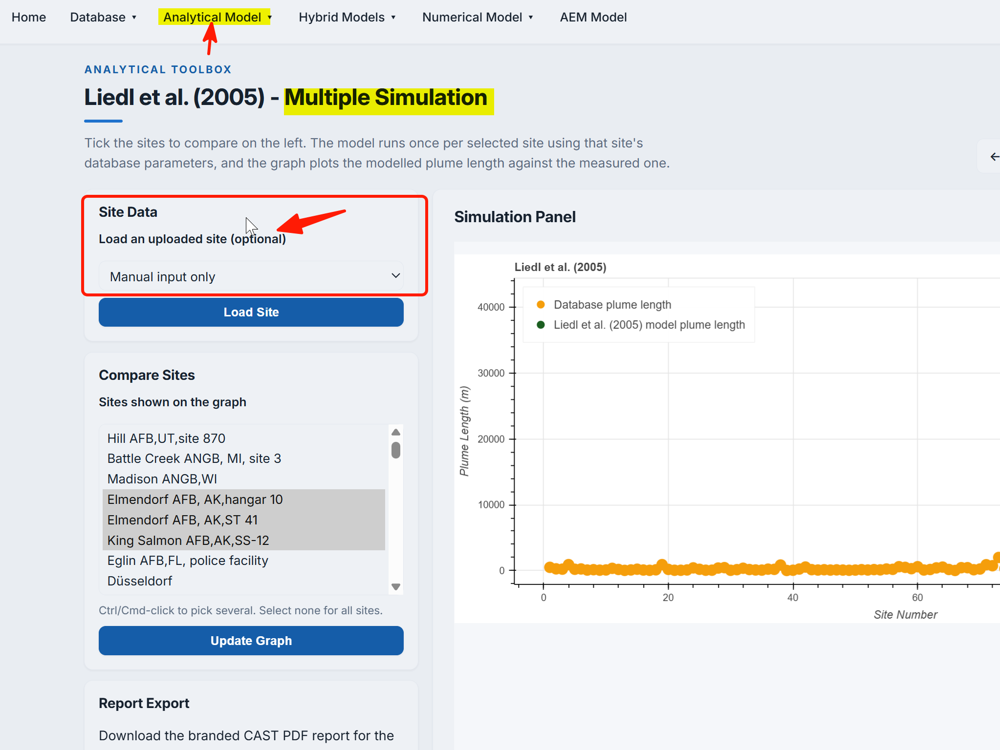{#fig-fig3.1-ix width="100%"}

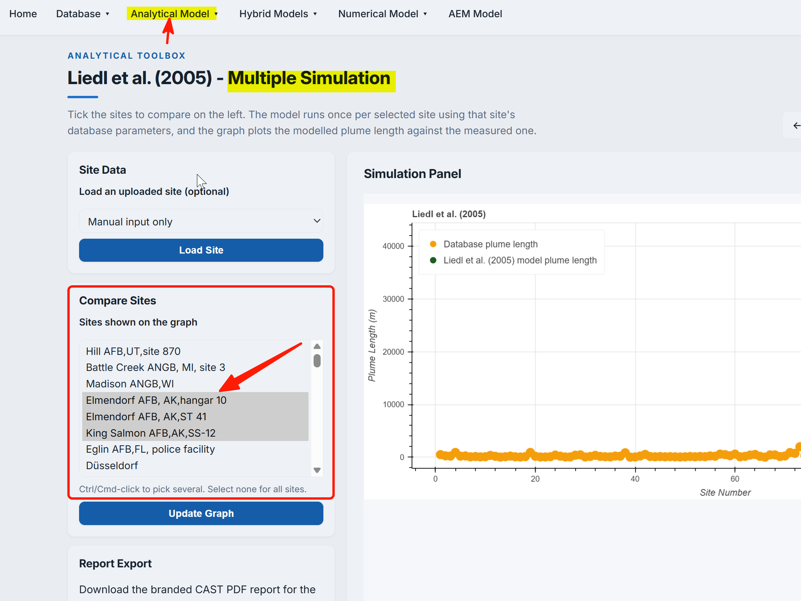{#fig-fig3.1-x width="100%"} 

@liedl2005: Selecting sites data from database for multiple computations

:::

***Creating multiple scenarios—offline mode***

You can also _upload_ your own site dataset for which you have to first download _the data template_ file (a _.csv_ file). For this first you need to download the sample by clicking at **`Download Sample File`** (see @fig-fig3.1-xi).  Download the **`.csv`** file and fill the required data. The filling of data or creating of scenario can be done while being _offline._

::: {.callout-warning}
Do not change the heading name used in sample file.
:::

Once your data _.csv_ is ready, click on **`Choose File`** option, a search and select window will appear from where you can select your required file and finally click on **open** button to select it. After you have selected you file, _the file name_ will appear next to **`Choose File`** button. Next, click on **`Upload`** button as shown on @fig-fig3.1-xi, and based on the parameters defined in your file, system will generate the $L_{max}$ results on screen.

::: {#fig-fig3.1-xi}

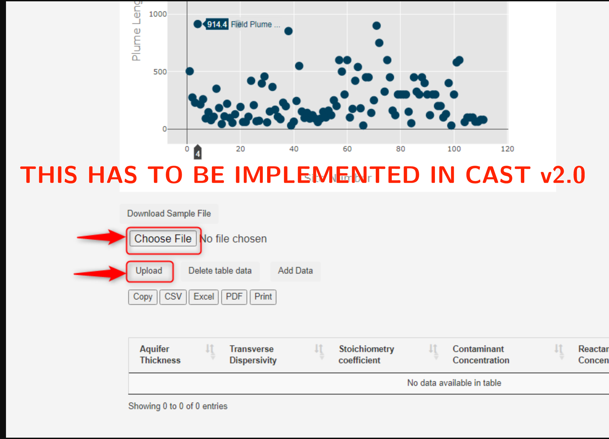{
width="80%" 
height="350px" 
fig-align="center" 
fig-alt="Screenshot of liedl2005 - Providing multiple scenarios data to the PACS interface"}

@liedl2005: Providing multiple scenarios data to the PACS interface

:::

The user needs to make sure that the file is in the format of the sample dataset. In such cases and in the case where the range or values of parameters don’t match the permitted, system will display an error message (see @fig-fig3.1-xii). You are required to rectify all the issues before uploading again.

::: {.callout-important}
The online version of PACS has restricted parameter range. This is required to ensure that calculation and results are displayed with available internet requirements

For the offline version, the range can be set by user themselves.
:::

::: {#fig-fig3.1-xii}

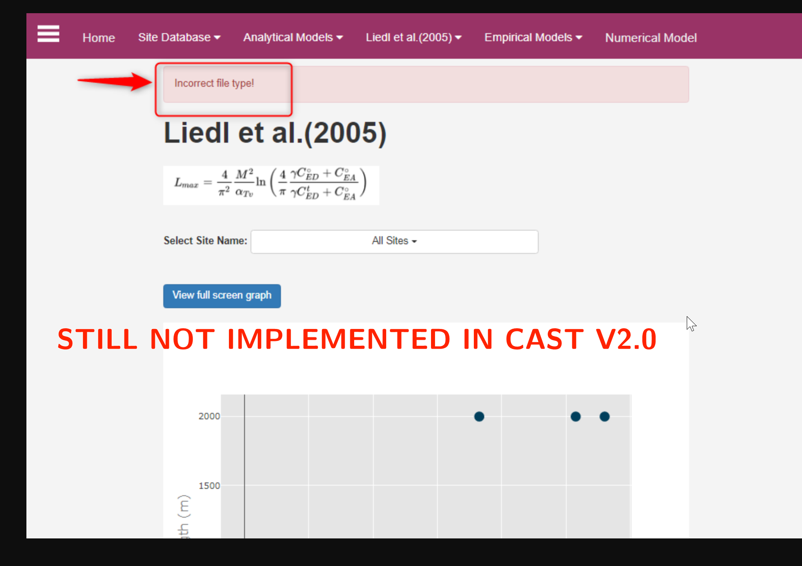{
width="80%" 
height="350px" 
fig-align="center" 
fig-alt="Screenshot of liedl2005 - Error message due to file format or data range in user provided data"}

@liedl2005: Error message due to file format or data range in user provided data

:::

***Creating multiple scenarios—online mode***

For limited number of scenario data can be manually entered in the data table. This will require network connection for the online PACS. 
For adding data _manually,_ click on the **`Add Data`** button as can be seen in screenshot @fig-fig3.1-xiii.

::: {#fig-fig3.1-xiii}

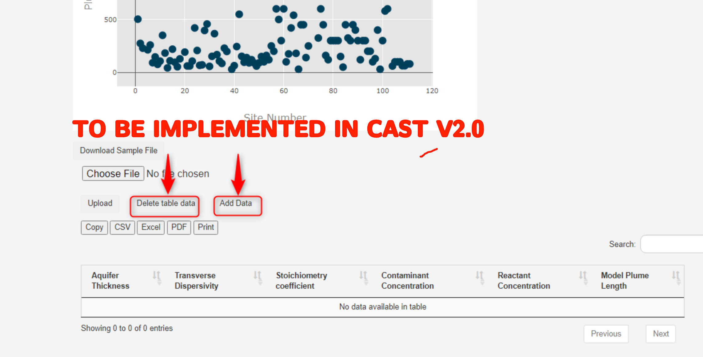{
width="80%" 
height="350px" 
fig-align="center" 
fig-alt="Screenshot of liedl2005 - Manually adding scenario data to PACS"}

@liedl2005: Manually adding scenario data to PACS

:::

By doing so, new window will appear on screen, here you can enter you data manually into the **boxes** that appears, clicking on the **`Update Graph`** button will provide the computed $L_{max}$ graphically. @fig-fig3.1-xiv shows the screenshot of the steps.

::: {#fig-fig3.1-xiv}

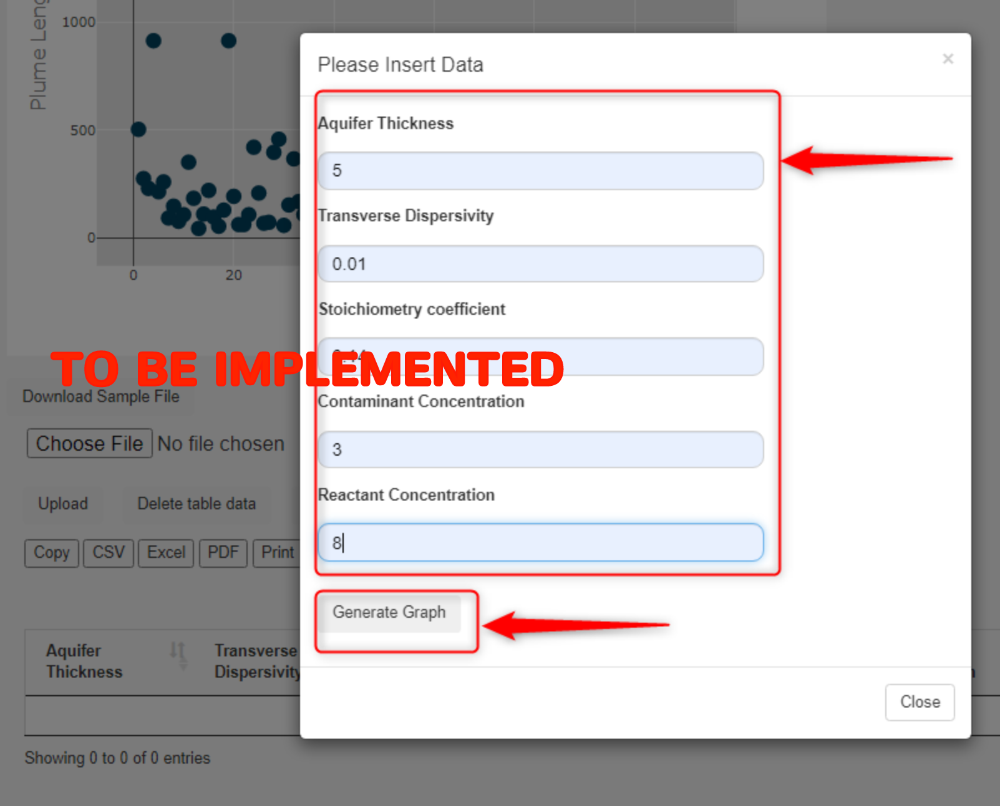{
width="80%" 
height="350px" 
fig-align="center" 
fig-alt="Manually adding scenario obtaining the results"}

@liedl2005: Manually adding scenario obtaining the results

:::

If the entered values are in permitted range, system will display a message, **your entry has been added**. And based on the parameters defined, system will generate a new result graph (see below @fig-fig3.1-xv). In case you wish to **delete** your results and start fresh, click on **`delete table data`** button, as shown in @fig-fig3.1-xiii.

::: {#fig-fig3.1-xv}

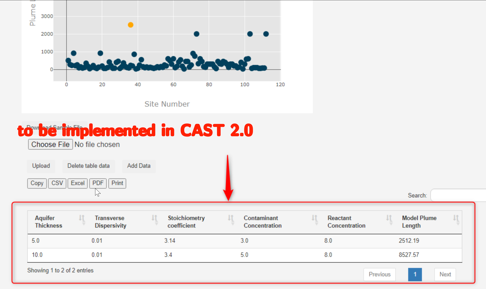{
width="80%" 
height="350px" 
fig-align="center" 
fig-alt="Output of manually added scenarios"}

@liedl2005: Output of manually added scenarios

:::

The results obtained can be download in three different formats, `.csv`, `.xls`, and `.pdf`. Clicking the **`print`** button, as shown on attached screenshot @fig-fig3.1-xvi, will allow the print of pdf of the results. The entire report can be downloaded in **PDF** format by clicking on the **`Download PDF Report`** button

::: {#fig-fig3.1-xvi}

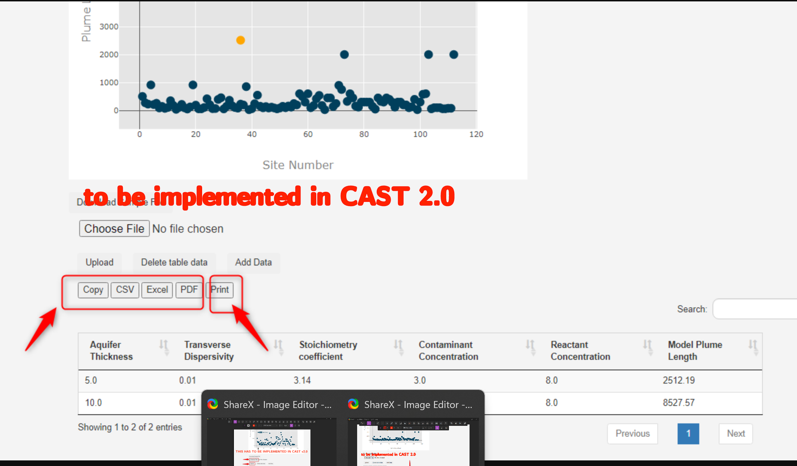{
width="80%" 
height="350px" 
fig-align="center" 
fig-alt="Downloading/saving obtained results in different formats and printing results"}

@liedl2005: Downloading/saving obtained results in different formats and printing results

:::

