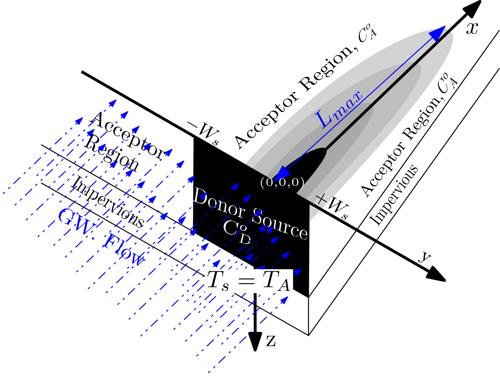
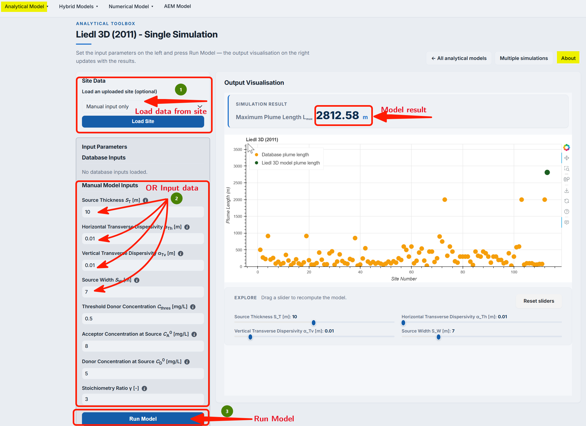
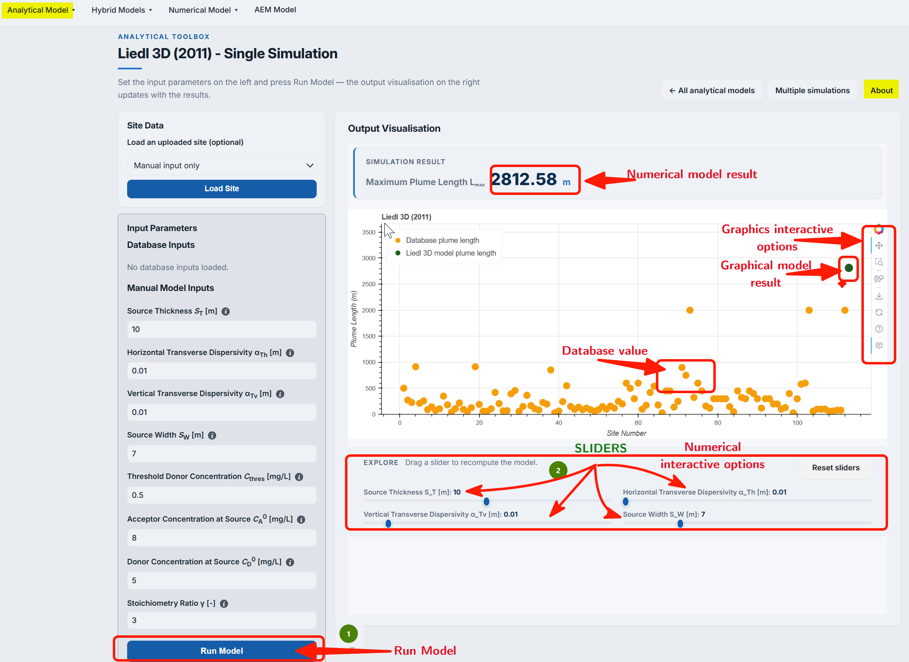
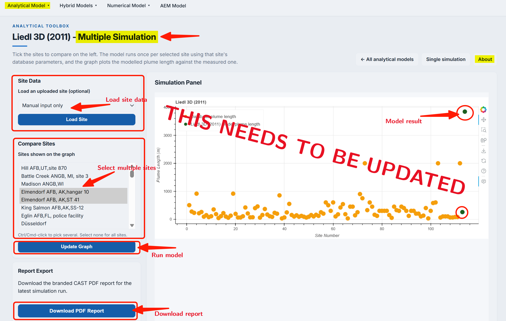
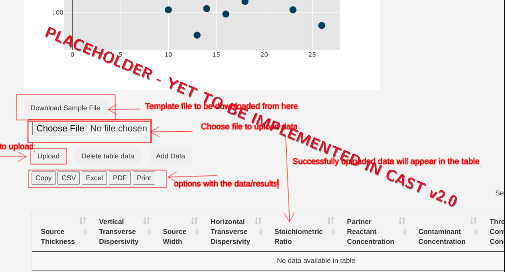

## Model description

This model, based on @liedl2011, provides an estimate of a steady-state plume length ($L_{max}$ ) from a 3D model domain (see @fig-fig3.5-i). This model extends the 2D model present in @liedl2005. As is in the 2D model, in this model too, the vertical orientation refers to $z$-axis, which is aligned along the aquifer thickness. Both domain width and length is infinite in this model with finite aquifer thickness $T_A$[L] equalling the contaminant source thickness $(T_s)$[L]. The contaminant source is a rectangular (or square) patch with dimension of source width $(W_s)$[L] and $T_s$  

::: {#fig-fig3.5-i}

{
width = "80%"
height = "400px"
fig-align="center" 
fig-alt="Conceptual setup of Liedl2011 model"}

@liedl2011: Conceptual setup

:::


@liedl2011 provides the following implicit expression for $L_{max}$:

::: {.column-margin}
**Symbols:**

$T_s$ = Source Thickness [L]<br/>
$\alpha_{Tv}$ = Vertical Transverse Dispersivity [L]<br/>
$W$ = Source Width [L]<br/>
$\alpha_{Th}$ = Horizontal Transverse Dispersivity [L]<br/>
$\gamma$ = Reaction stoichiometric ratio [ ]<br/>
$C_{D}^\circ$ = Contaminant (Electron Donor) concentration [ML$^{-1}$]<br/>
$C_{A}^\circ$ = Partner Reactant (Electron Acceptor) concentration [ML$^{-1}$]<br/>
$C_{Thres}$ = Threshold Contaminant Concentration [ML$^{-1}$]
:::

$$
\text{erf}\bigg(\frac{W_s}{\sqrt{4\alpha_{Th}L}}\bigg)\,\text{e}^{-\alpha_{Tv}L \big(\frac{\pi}{2T_s}\big)^2} =\frac{\pi}{4}\frac{\gamma C_{Thres}+C_{A}^\circ}{\gamma C_{D}^\circ+C_{A}^\circ}
$$ {#eq-eqli2011} 


The $C_{Thres}$ in this model allows to set the contaminant concentration to any value greater than or equal to zero, and then $L_{max}$ is length from the origin to that maximum distance of $C_{Thres}$ along $x$-axis. 

***The model is based on the following assumptions***

1. `Steady-state` condition in a homogeneous and isotropic aquifer.
2. A single step bi-molecular `instantaneous reaction` between reactants taking place only at the fringe.
3. The contaminant source (Electron Donor) penetrates entire thickness of the aquifer, i.e., **$T_s = T_A$**

## Solving for $L_{max}$ using @liedl2011

Iterative methods is required to solve for $L_{max}$ using eq.  @eq-eqli2011. This is because eq.  @eq-eqli2011 is implicit with respect to $L_{max}$. [Newtwon-Raphson](https://en.wikipedia.org/wiki/Newton%27s_method) iterative scheme is used in **PACS**. The details below very briefly describe the used scheme. 


Newtwon-Raphson iterative methods requires finding the first derivative of eq. @eq-eqli2011, and a good starting value to initiate the iterator. 

PACS uses central [Finite Difference](https://en.wikipedia.org/wiki/Finite_difference) scheme to obtain the required defferential. 

::: {.callout-note collapse="true" title="Code for obtaining the differential"}
```python
# Defining the main function
def f_lm(x): # Liedl 2011- f(x) = 0
    return erf(W_s/(np.sqrt(4*ath*x)))*np.exp(-atv*x*(np.pi/(2*T_s))**2)-(np.pi/4)*((ga*Ct+Ca)/(ga*Cd + Ca)) 

# Central difference estimate
def df_lm(x):
    h = 1e-4
    return (f_lm(x+h) - f_lm(x-h))/(2*h)
```
:::


For initial value $L_{max}$ estimated from [Liedl et al. (2005)](liedl2005.qmd) model is used.

::: {.callout-note collapse="true" title="Code for obtaining the initial value"}
```python
Cf = (ga*Ct+Ca)/(ga*Cd+Ca)

ma_1 = -1/(np.pi*(ath/W_s**2)*np.log(1-0.25*np.pi*(Cf)))   
ma_2 = -2/(np.pi**2*(atv/T_s**2))*np.log(0.25*np.pi*(Cf))
ma_3 = 4/np.pi**2*(M**2/atv)*np.log(4/(np.pi*Cf)) # Liedl et al. 2005

min_x0 = np.minimum(ma_1, ma_2) # min starting value
max_x0 = np.minimum(np.maximum(ma_2, ma_3), ma_1)

print("The minimum starting value {0:2.2f} m".format(min_x0)) 
print("The maximum starting value {0:2.2f} m".format(max_x0))
 
if max_x0 == ma_3:
    print("The initial value is {0:2.2f} m".format(max_x0))
    x0 = max_x0
else:
    print("The initial value is {0:2.2f} m".format(min_x0))
    x0 = min_x0 
```
:::

The **main** iterative Newton-Raphson code that is used in the PACS can be found below. The convergence tolerance is set at 1e-06. The code uses only a initial value as an input.

```python
# Newton Raphson simulation using FD
# x is the initial value.
def NR(x): 
    iterat = 0
    tol = 1e-06
    h = f_lm(x)/df_lm(x)
    print("Iter. Nr ","", "Lmax","       " , " Residual")
    print('-'*35)   
    
    while abs(h)>= tol:
        h = f_lm(x)/df_lm(x) 
        x = x - h
        iterat+= 1 
        print(" ",iterat,  "    " , "%.4f "% x, "   " , "%.2e " %  h) 
```


## Using Liedl et al. (2011) model in PACS

***Single computing interface***

The **PACS** user-interface for all the analytical models are identical. This is true for both **single computing interface** and **multiple simulation interface**. The identical interface simplifies the use of models in the PACS. Therefore, the extensive details on using the @liedl2005 model in **PACS** provided [here](liedl2005.qmd) can be used also for the @liedl2011.

The difference in each model interface is the model specific parameters. The 3D models as opposed to 2D models requires significantly more number of input parameters. This can be observed in the PACS screenshot (@fig-fig3.5-ii) below:

::: {#fig-fig3.5-ii}

{
width = "80%"
height = "400px"
fig-align="center" 
fig-alt="Single computing interface of Liedl2011 model"}

@liedl2011: Single computing interface

:::


Once the input data is placed in the boxes, user need to click on the `Run Model` button to get the result. Results are obtained as a absolute number above the `Generate Graph` and also graphically, which provides field plume length data from the database. This allows a visual comparsion of model $L_{max}$ with the field data.

::: {.callout-note title="Limited input range **Online** version"}
The range of input parameter value in the **online** version of PACS is fixed. This is to ensure computation is possible on online mode. User are given feedback when the input value is beyond the allowed range.

Such limits can be avoided for **offline** version of PACS.
:::

As detailed in the use of [Liedl et al. (2005) model - check here](liedl2005.qmd), the resulting graph provides several interactive options to evaluate results. The screenshot below (@fig-fig3.5-iii) provides the output of the **single computing mode** of PACS.


::: {#fig-fig3.5-iii}

{
width = "80%"
height = "400px"
fig-align="center" 
fig-alt="Interactive options in the Single computing interface"}

@liedl2011: Interactive options in the Single computing interface

:::


***Dynamically comparing model results using sliders***

**Sliders** are activated once the `Generate Graph` button is clicked (see @fig-fig3.5-iii). **Sliders** are provided for more critical model parameters that have been suggested in @liedl2011 paper. **Sliders** changes the model input parameter; for which the output $L_{max}$ appears in the graph. This enables a dynamic computation and visualization. Delay in result output can be observed as Liedl et al. (2011) model computes $L_{max}$ iteratively.


***Multiple computing interface***

The **multiple computing interface** of the @liedl2011 model is identical to other analytical model interface. The goal of the multiple computing interface to develop several scenario and compare the output of the scenario with that of the field data. As can be observed in the screenshot below, users has an option to select the site(s) they would like to compare their scenarios. 

::: {#fig-fig3.5-iv}

{
width = "80%"
height = "400px"
fig-align="center" 
fig-alt="Selecting field site to compare model results"}

@liedl2011: Selecting multiple field site to compare model results

:::

The interface of **multiple computing interface** is provided in the screenshot below. Details on the options are identical to that provided for Liedl et al. (2005) model that is provided [here](liedl2005.qmd).

::: {#fig-fig3.5-v}

{
width = "80%"
height = "400px"
fig-align="center" 
fig-alt="Interface for multiple computing interface."}

@liedl2011: Interface for multiple computing interface

:::


