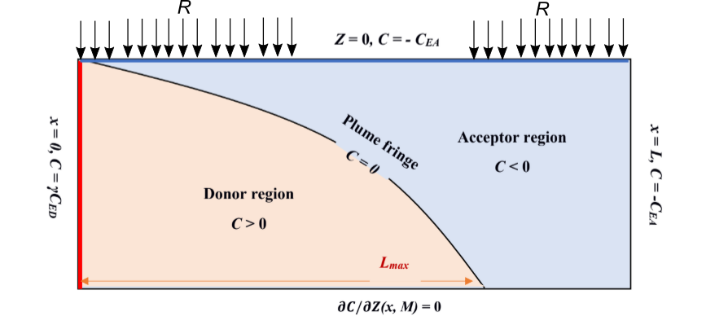
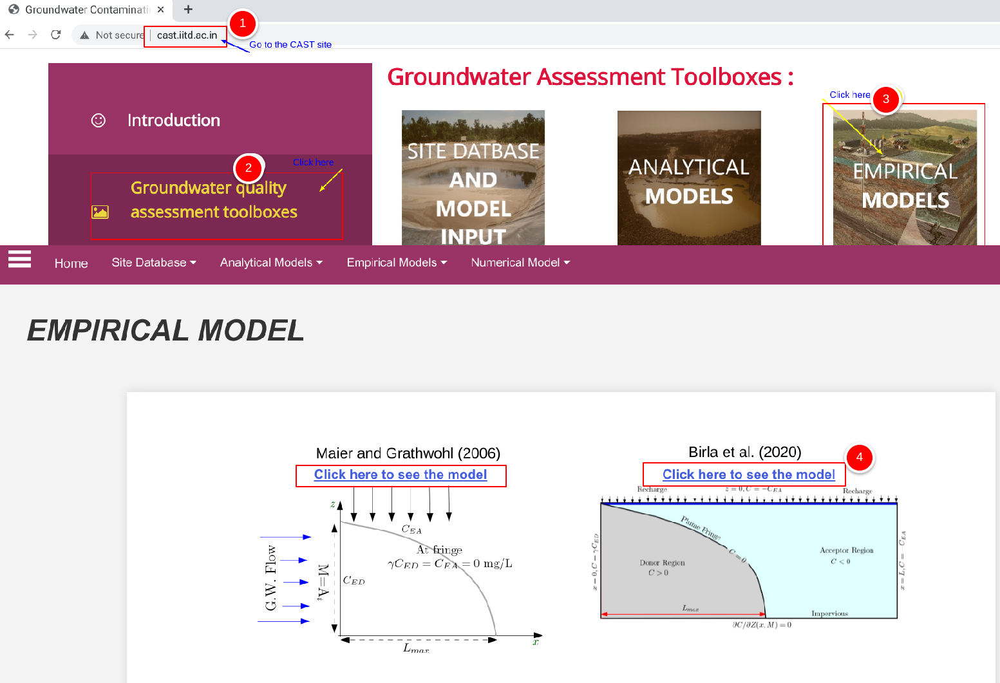
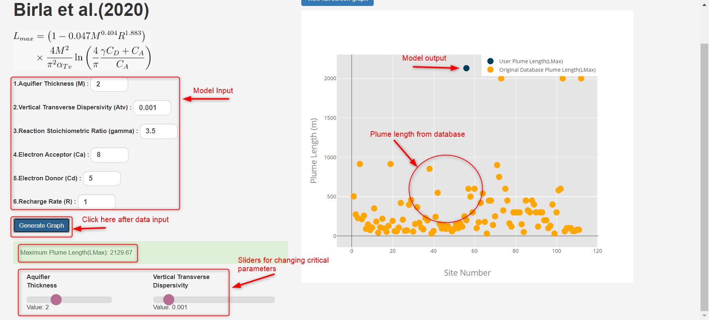
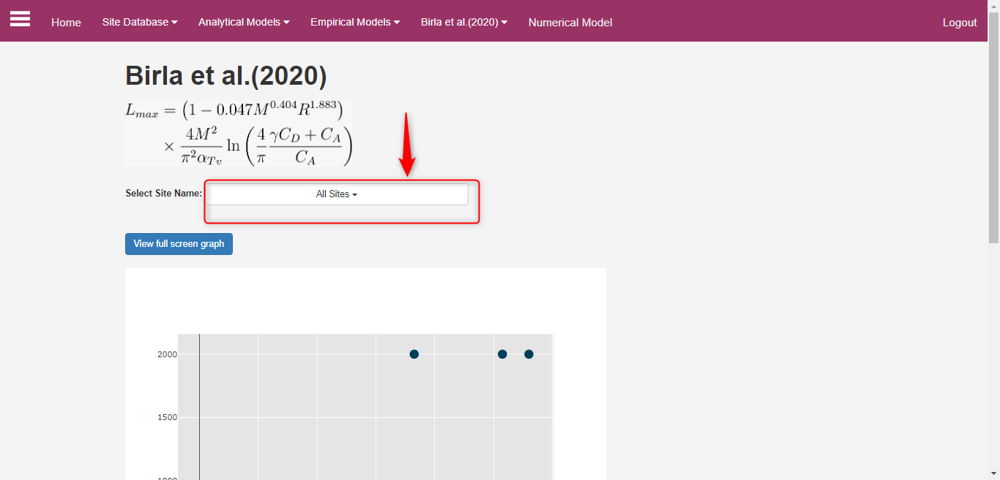
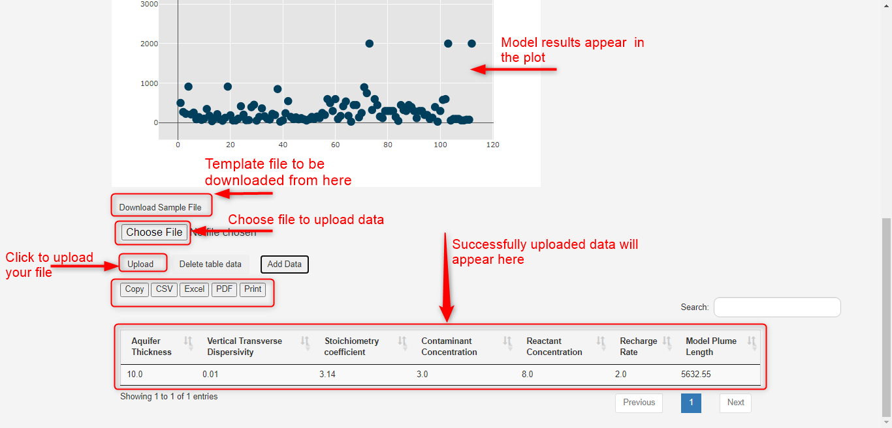

# ii. Birla et al. (2020) Model {.unnumbered}

## Model Description

This is a 2D empirical model, based on [Birla et al. (2020)](#refbirla2020). The empirical model is based on the hybrid concept of combining an analytical model with an empirical function. The analytical model used is [Liedl et al. 2005](../an_model/liedl2005.qmd) model and empirical function is developed using MODFLOW/MT3DMS based numerical experimentation. The experimentation part uses the effect of recharge on the plume extension. The figure below provides the conceptual set-up of Birla et al. (2020).

{#fig-4-ii-01 fig-align="center" width="60%"}

[Birla et al. (2020)](#refbirla2020) provides the following explicit expression for $L_{max}$:

$$
L_{max} = ({1-0.047{M^.404}{R^{1.833}}})\frac{4}{\pi^2}\frac{M^2}{\alpha_{Tv}}\ln\bigg(\frac{4}{\pi}\frac{\gamma C_{ED}^\circ + C_{EA}^\circ }{C_{EA}^\circ}\bigg)
$$

::: {.column-margin}
**Symbols:**

$M$ = Source Thickness [L], which is equal to Aquifer thickness ($A_t$) [L] 
$\alpha_{Tv}$ = Vertical Transverse Dispersivity [L] 
$\gamma$ = Reaction stoichiometric ratio [ ] 
$C_{ED}^\circ$ = Contaminant (Electron Donor) concentration [ML$^{-3}$] 
$C_{EA}^\circ$ = Partner Reactant (Electron Acceptor) concentration [ML$^{-3}$] 

$R$= Recharge rate [L$^{3}$T$^{-1}$]
:::

**The model is based on the following assumptions:**

1. Steady-state condition in a homogeneous and isotropic aquifer.
2. A single step bi-molecular instantaneous reaction between reactants taking place only at the fringe.
3. The contaminant source (Electron Donor) penetrates entire thickness of the aquifer.
4. Recharge is uniform thorughout the domian and is continuous.

## Using the Model in CAST

Clicking the **Empirical Toolbox** box in the homepage (@fig-4-ii-02) will lead to the interface that lists all the empirical models available in the CAST. To use the Birla et al. (2020) model from the interface shown in the screenshot below, please click on the option ``Click here to see the model`` below the Birla et al. (2020) as shown on the screenshot below.

{#fig-4-ii-02 fig-align="center" width="60%"}

***Single computing interface***

The CAST user-interface is identical for both the analytical as well as empirical models which makes it more user-friendly. This is true for both single computing interface and multiple simulation interface. Therefore, the extensive details on using the [Liedl et al. (2005)](../an_model/liedl2005.qmd) model in CAST can also be used for the Birla et al. (2020).

The only difference in each model interface lies in the model specific parameters. This can be observed in the CAST screenshot below: 

{#fig-4-ii-03 fig-align="center" width="50%"}

After all the required fields are filled up, a user needs to click on the  **``Generate Graph``** to get the result. Results are obtained as an absolute number below the ``Generate Graph`` button and also graphically, which provides the field plume length data from the database. This allows a visual comparison of the model $L_{max}$with the field data.

As explained in detail in the analytical model [Liedl et al. (2005)](../an_model/liedl2005.qmd), the resulting graph provides several interactive options to evaluate results. The screenshot below provides the output of the single computing mode of CAST.

**Dynamically comparing model results - using sliders**

Sliders (see @fig-4-ii-03) become activate only after the **``Generate Graph``** is clicked (see Interactive options in the Single computing interface). Sliders are provided for more critical model parameters that have been suggested in Birla et al. (2020) paper. Sliders changes the model input parameters; for which the output $L_{max}$ appears in the graph. This enables a dynamic computation and visualization.

***Multiple computing interface***

The multiple computing interface of the Birla et al. (2020) model is identical to the  interface of analytical model [Liedl et al. (2005)](../an_model/liedl2005.qmd). The goal of the multiple computing interface is to develop several scenarios and compare the output of these scenarios with that of the field data. As can be observed in the screenshot below, users have an option to select the site(s) they would like to compare their scenarios with.

{#fig-4-ii-04 fig-align="center" width="60%"}

The interface of multiple computing interface is provided in the screenshot below. Details on the options are identical to that provided for [Liedl et al. (2005)](../an_model/liedl2005.qmd). The screenshot below is for clarification.

{#fig-4-ii-05 fig-align="center" width="60%"}

## Reference {#refbirla2020}

Birla, s., Yadav, P.K., Mahalawat, P., Haendel, F., Liedl, R., Chahar, B. 2020. Influence of recharge rates on steady-state plume lengths. Jour. Contam. Hydrol. https://doi.org/10.1016/j.jconhyd.2020.103709

