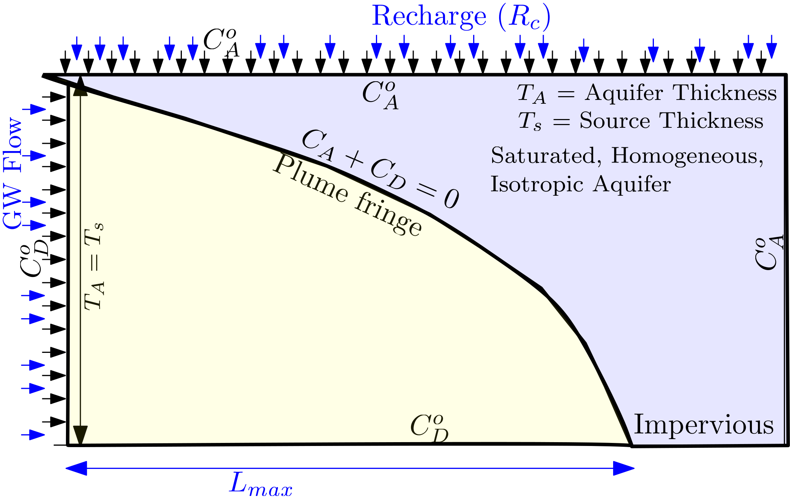
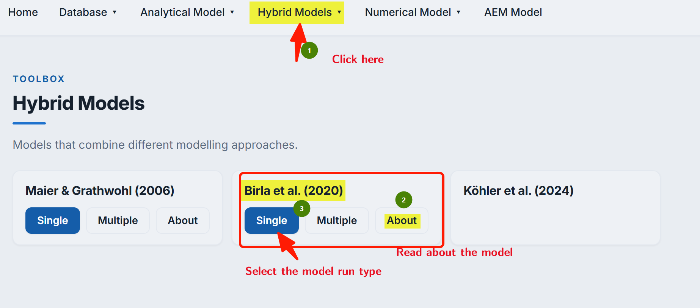
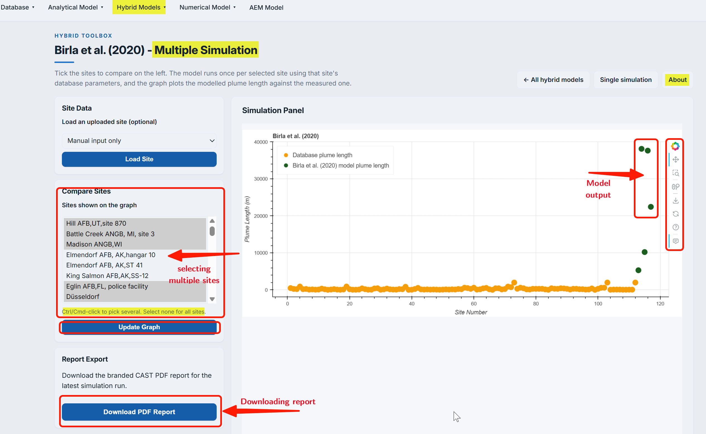
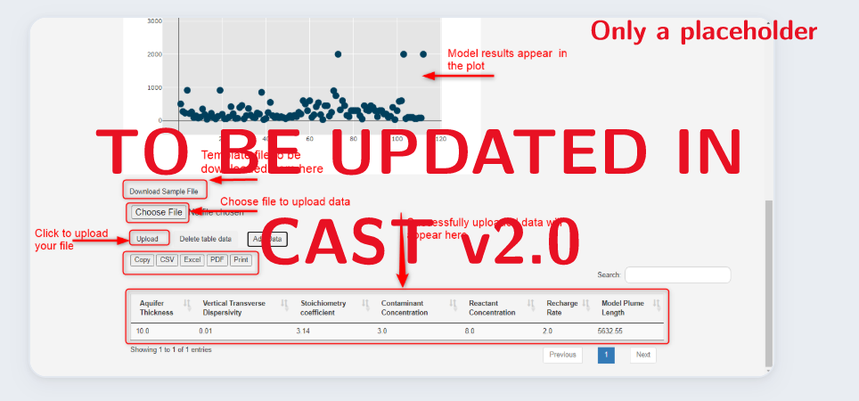

## Model Description

This is a 2D empirical model, based on @birla2020 paper. The hybrid model is based on the hybrid concept of combining an analytical model with an empirical function. The analytical model used is [@liedl2005](../an_model/liedl2005.qmd) model and empirical function is developed using `MODFLOW/MT3DMS` based numerical experimentations. The experimentations part uses the effect of recharge ($R$) on the plume extension. The figure below provides the conceptual set-up of @birla2020.

::: {#fig-fig4.1-i}

{
width = "80%"
height = "400px"
fig-align="center" 
fig-alt="Conceptual setup of birla2020 model"}

@birla2020: Conceptual setup

:::

@birla2020 provides the following explicit expression for $L_{max}$:

$$
 L_{max} = (1-0.047{T_s^{0.405}{R^{1.833}}})\frac{4}{\pi^2}\frac{T_s^2}{\alpha_{Tv}}\ln\bigg(\frac{4}{\pi}\frac{\gamma C_{D}^o + C_{A}^o }{C_{A}^\circ}\bigg)
$$

::: {.column-margin}
**Symbols:**

$T_s$ = Source Thickness [L], which is equal to Aquifer thickness ($T_A$) [L] 
$\alpha_{Tv}$ = Vertical Transverse Dispersivity [L] 
$\gamma$ = Reaction stoichiometric ratio [ ] 
$C_{D}^\circ$ = Contaminant (Electron Donor) concentration [ML$^{-3}$] 
$C_{A}^\circ$ = Partner Reactant (Electron Acceptor) concentration [ML$^{-3}$] 

$R$= Recharge rate [L$^{3}$T$^{-1}$]
:::

**The model is based on the following assumptions:**

1. `Steady-state` condition in a homogeneous and isotropic aquifer.
2. A single step bi-molecular `instantaneous reaction` between reactants taking place only at the fringe.
3. The contaminant source (Electron Donor) penetrates `entire thickness` of the aquifer.
4. Recharge is `uniform` thorughout the domian and is continuous.

## Using Hybrid Models

Clicking the **Hybrid Toolbox** box in the homepage (@fig-fig4.1-ii) will lead to the interface that lists all the Hybrid models available in the CAST. To use the @birla2020 model from the interface shown in the screenshot below, click on the option ``about`` or choose type of model run `single` or `multiple` below the @birla2020 as shown on the screenshot below.

::: {#fig-fig4.1-ii}

{
width = "80%"
height = "400px"
fig-align="center" 
fig-alt="Selection of the hybrid model"}

@birla2020: Selection of the hybrid model

:::

***Single computing interface***

The CAST user-interface is identical for both  analytical as well as Hybrid models. This makes it more user-friendly. This is true for both single computing interface and multiple simulation interface. Therefore, the extensive details on using the [Liedl et al. (2005)](../an_model/liedl2005.qmd) model can also be used for the @birla2020 model.

The only difference in each model interface lies in the model specific parameters. This can be observed in the CAST screenshot below: 

::: {#fig-fig4.1-iii}

 model"){
width = "80%"
height = "400px"
fig-align="center" 
fig-alt="Parameters required in Birla et al. (2020) model"}

@birla2020: Single simulation and interactions options

:::

After all the required data input fields are filled up, the user needs to click on the  **``Run model``** to get the result. Results are obtained as an absolute number above the ``Generated Graph`` and also graphically, which provides the field plume length data from the database. This allows a visual comparison of the model $L_{max}$with the field data.

As explained in detail in the analytical model [Liedl et al. (2005)](../an_model/liedl2005.qmd), the resulting graph provides several interactive options to evaluate results. The screenshot above (@fig-fig4.1-iii) provides the output of the single computing mode of CAST.

**Dynamically comparing model results - using sliders**

Sliders (see @fig-fig4.1-iii) become activate only after the **``Run model``** is clicked (see Interactive options in the Single computing interface). Sliders are provided for more critical model parameters that have been suggested in the @birla2020 paper. Sliders changes the model input parameters; for which the output $L_{max}$ appears in the graph. This enables a dynamic computation and visualization.

***Multiple computing interface***

The multiple computing interface of the @birla2020 model is identical to the  interface of analytical model [Liedl et al. (2005)](../an_model/liedl2005.qmd). The goal of the multiple computing interface is to develop several scenarios and compare the output of these scenarios with that of the field data. As can be observed in the screenshot (@fig-fig4.1-iv) below, users have an option to select the site(s) they would like to compare their scenarios with. The final `report` of the simulation can be downladed in the **PDF** format from the interface. The report includes, data input, numerical and graphical output information.

::: {#fig-fig4.1-iv}

{
width = "80%"
height = "400px"
fig-align="center" 
fig-alt="Selecting site to compare using multiple computing interface"}

@birla2020: Selecting site to compare using multiple computing interface

:::

The interface of multiple computing interface is provided in the screenshot below. Details on the options are identical to that provided for [Liedl et al. (2005)](../an_model/liedl2005.qmd). The screenshot below is for clarification.

::: {#fig-fig4.1-v}

{
width = "80%"
height = "400px"
fig-align="center" 
fig-alt="Available options for multiple model input "}

@birla2020: Available options for multiple model input and computations
:::

