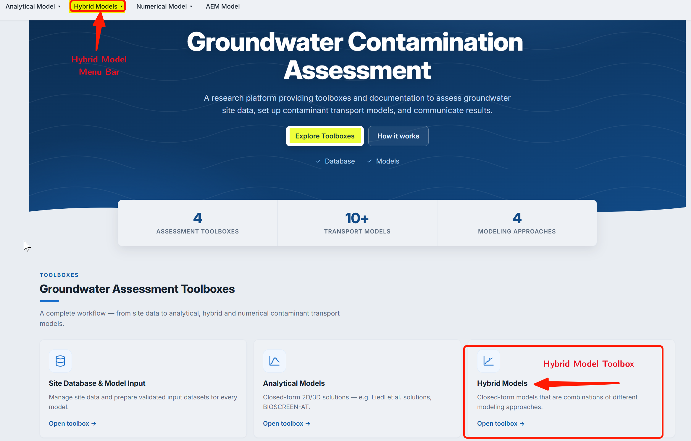
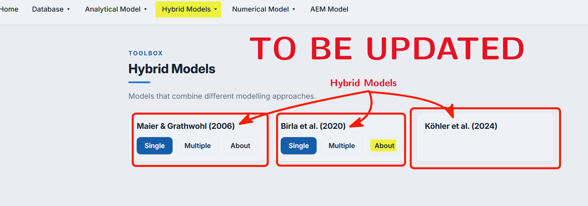

In PACS the **Hybrid models** are those model that applies a combination of modeling approaches (e.g., analytical and numerical) to often provide a closed-form expression for obtaining, e.g., $L_{max}$.  To distinguish further **hybrid models** are those that are completely based on some form of experimentations. Experiments can be numerical, based on data, or of any other form. In general **hybrid model** will thus require some fit to experimental results to provide solution, which can be a closed-form expression or may require some simple numerical approach (e.g., integration) to obtain the final expression. \

Literature provide only few **hybrid models**. Thus, only **3** empirical models are part of the current version of PACS. These are briefly presented below and explained in details in the respective model simulation sections.

## Hybrid Models in PACS
Included models are (_see individual model page for details_):

1. [@birla2020](birla2020.qmd)

$$
 L_{max} = (1-0.047{T_s^{0.405}{R^{1.833}}})\frac{4}{\pi^2}\frac{T_s^2}{\alpha_{Tv}}\ln\bigg(\frac{4}{\pi}\frac{\gamma C_{D}^o + C_{A}^o }{C_{A}^\circ}\bigg)
$$
2. [@maier2006](mg2006.qmd) 

    $$
 L_{max} = 0.5\frac{T_s^2}{\alpha_{Tv}}\bigg(\frac{\gamma C_{D}^o}{C_{A}^o}\bigg)^{0.3} 
  $$
3. [@kohler2024](kohler2024.qmd)

$$
L_{m a x}=A_1+A_2 \cdot \lambda_{e} + A_3 \cdot v + A_4 \cdot \lambda_{e}^2+A_5 \cdot v^2+A_6 \cdot \lambda_{e} \cdot v
$$
$$
T_{L \text { max }}=B_1+B_2 \cdot \lambda_{e}+B_3 \cdot \Gamma+B_4 \cdot \lambda_{e}^2+B_5 \cdot \gamma^2+B_6 \cdot \lambda_{e}\cdot \Gamma
$$

where $A_1 - A_6$ and $B_1 - B_6$ are empirical fit parameters (details are provided in model description page)

## Computing Interfaces in PACS

The `hybrid model` interface of PACS can be accessed from the PACS [Homepage  - pls. provide the link](www). [Registration/Login](../../start/accounts.qmd) information are required for using Hybrid models. The registration info are for caching data during the computation. Verification of registration information are not performed, i.e., fake or temporary emails can be used.    

::: {#fig-fig4.0-i}

{
width = "80%"
height = "350px"
fig-align="center" 
fig-alt="Available Hybrid models"}

Available Hybrid models

:::

Similar to  analytical model toolbox, the following two computing interfaces are available for hybrid models:

1. Single computing interface
2. Multiple computing interface

Details on these interfaces, which is identical to the interface for `analytical models` are provided [here - pls. check the link](../an_model/an_model.qmd). The screenshot provides the PACS interface to select a hybrid model.

::: {#fig-fig4.0-ii}

{
width = "80%"
height = "350px"
fig-align="center" 
fig-alt="Hybrid models - Interfaces"}

Hybrid models - Available computing interfaces

:::

