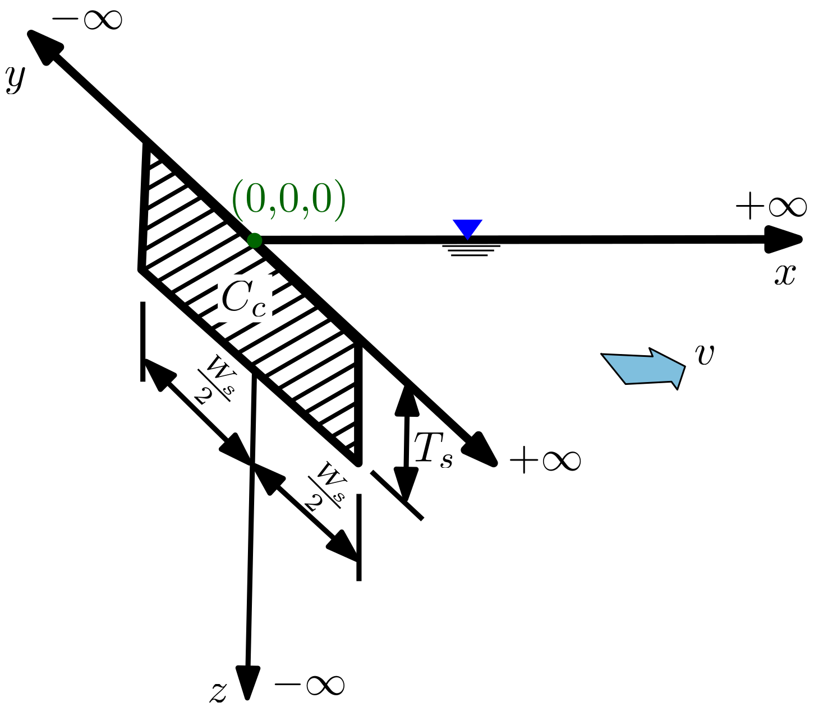
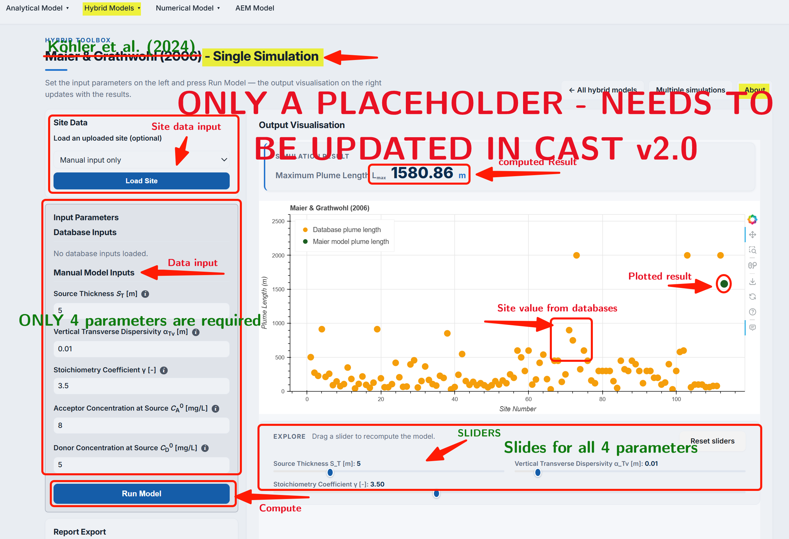
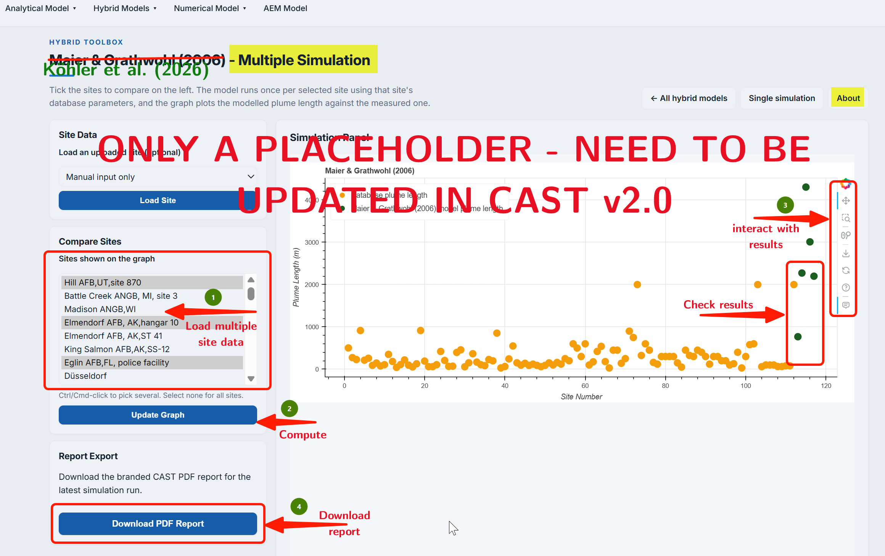

## Model Description

@kohler2024 2D model provides an estimate of a steady-state plume length ($L_{max}$) and also the time to reach the steady-state condition. The model is based on large (over few thousands) number of experimentation by varying several site parameters. The model expression is then developed based on sensitivity analysis and statistical fitting, following the Machine Learning approaches, for obtaining $L_{max}$. @kohler2024 conceptual set-up (see @fig-fig4.3-i) is similar to that of @karanovic2007 (BIOSCREEN-AT) model. The key difference among these two models is that BIOSCREEN-AT requires over 10 parameter and large number of simulation to obtain $L_{max}$, whereas @kohler2024 model can obtain it using only 2 field parameters from a simple algebraic equation.

::: {#fig-fig4.3-i}
{ 
    width = "80%" 
    height = "400px" 
    fig-align="center" 
    fig-alt="Conceptual setup of Köhler2026 model"
    }

@kohler2024: Conceptual setup
:::

@kohler2024 provides the following explicit expressions for $L_{max}$ and $T_{Lmax}$, respectively:

$$
L_{m a x}=A_1+A_2 \cdot \lambda_{e} + A_3 \cdot v + A_4 \cdot \lambda_{e}^2+A_5 \cdot v^2+A_6 \cdot \lambda_{e} \cdot v
$$ $$
T_{L \text { max }}=B_1+B_2 \cdot \lambda_{e}+B_3 \cdot \Gamma+B_4 \cdot \lambda_{e}^2+B_5 \cdot \gamma^2+B_6 \cdot \lambda_{e}\cdot \Gamma
$$

where $A_1 - A_6$ and $B_1 - B_6$ are empirical fit parameters (see @tbl-parameters). The coefficients do not required to be changed and therefore provided internally in the computation structure. Details of the computation methods as well as the process for obtaining the coefficients are provided in @kohler2024.

| ${L}_{\text {max }}$ model |            | $T_{\text {Lmax }}$ model |           |
|:--------------------:|:-------------:|:-------------------:|:-------------:|
|      **Coefficient**       | **Value**  |      **Coefficient**      | **Value** |
|          $A_{1}$           |  840.647   |          $B_{1}$          |  114.000  |
|          $A_{2}$           | -5808.705  |          $B_{2}$          | -398.104  |
|          $A_{3}$           |   49.982   |          $B_{3}$          |  -47.176  |
|          $A_{4}$           | 10,338.393 |          $B_{4}$          |  444.466  |
|          $A_{5}$           |   -0.024   |          $B_{5}$          |  14.728   |
|          $A_{6}$           |  -85.617   |          $B_{6}$          |  67.708   |

: The value of coefficients in the model {#tbl-parameters}

::: column-margin
**Symbols**

$T_s$ = Source Length \[L\]  $\alpha_{Tv}$ = Vertical Transverse Dispersivity \[L\]  $\gamma$ = Reaction stoichiometric ratio \[ \]  $C_{D}^o$ = Contaminant (Electron Donor) concentration \[ML$^{-3}$\]  $C_{A}^o$ = Partner Reactant (Electron Acceptor) concentration \[ML$^{-3}$\]
:::

## Model assumptions

The model is based on the following assumptions: 

1. Aquifer extends `semi-infinite` in $x$-direction, infinite in $y$-direction and extends from water table to relatively `large` depth.
2. Groundwater flow is steady and one dimensional in an homogeneous aquifer
3. The solute undergoes `equilibrium sorption` and `first-order` transformation reactions.
4. $L_{max}$ is always found on the center line.

## Using @kohler2024 model

***Single computing interface***

The PACS user-interface for both hybrid and analytical models are identical. This is true for both single computing interface and multiple simulation interfaces. The identical interface simplifies the use of models in the PACS. The extensive details on using computing interface are provided [here - please check the lick](../an_model/liedl2005.qmd), which can be used also for the @kohler2024 model.

The difference in each model interfaces of PACS is the model specific parameters. This can be observed in the screenshot (@fig-fig4.3-ii) below. It is to be noted that @kohler2024 model only requires 4 field parameters to estimate $L_{max}$ and $T_{Lmax}$.

::: {#fig-fig4.3-ii}

{ 
    width = "80%" 
    height = "400px" 
    fig-align="center" 
    fig-alt="Single computing interface of Köhler2026 model"}

@kohler2024: Single computing interface
:::

Once the input data is placed in the data field, user needs to click on the `Run Model` to get the result. Results are obtained as an absolute number **above** the generated graph and also graphically, which provides the field plume length data from the database. This allows a visual comparison of the model $L_{max}$ with the field data. As explained in detail in [Liedl et al. (2005)](../an_model/liedl2005.qmd) model, the resulting graph provides several interactive options to evaluate results.

**Dynamically comparing model results - using sliders**

**Sliders** (@fig-fig4.3-ii) are activated once the `Run Model` is clicked (see Interactive options in the Single computing interface). Sliders are provided for only critical model parameters that affects $L_{max}$ the most. The Sliders change the model input parameters, for which the output $L_{max}$ appears in the graph. This enables a dynamic computation and visualization.

***Multiple computing interface***

The multiple computing interface of the @kohler2024 model is identical to analytical model [Liedl et al. (2005)](../an_model/liedl2005.qmd) model interface. The goal of the multiple computing interface is to develop several scenarios and compare the output of these scenarios with that of the field data. As can be observed in the screenshot (in @fig-fig4.3-iii) below, users have an option to select the site(s) they would like to compare their scenarios with.

::: {#fig-fig4.3-iii}
{ 
    width = "80%" 
    height = "400px" 
    fig-align="center" 
    fig-alt="Multiple computing interface of @kohler2024 model"}

@kohler2024: Multiple computing interface
:::

The interface of multiple computing interface is provided in the screenshot (@fig-fig4.3-iv) below. Details on the options are identical to that provided for [Liedl et al. (2005)](../an_model/liedl2005.qmd). Interesting aspects of the interface are different options available for downloading model data and results in different formats. Also, important feature is the ability to load several model input parameter as a **.csv** file.

::: {#fig-fig4.3-iv}

{ 
    width = "80%" 
    height = "400px" 
    fig-align="center" fig-alt="Data input method in multiple computing interface of @kohler2024 model"
    }

@kohler2024: Data input method in multiple computing interface
:::