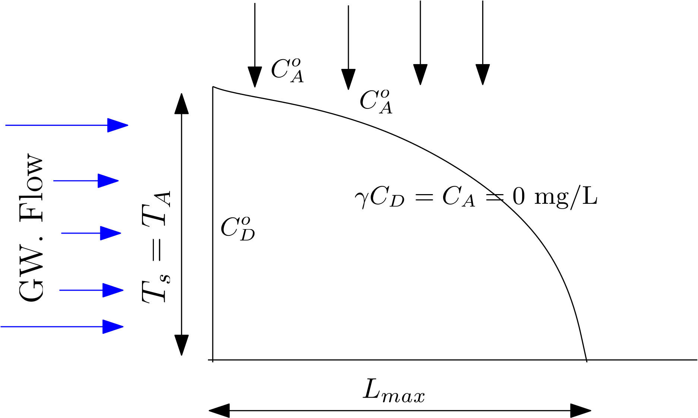
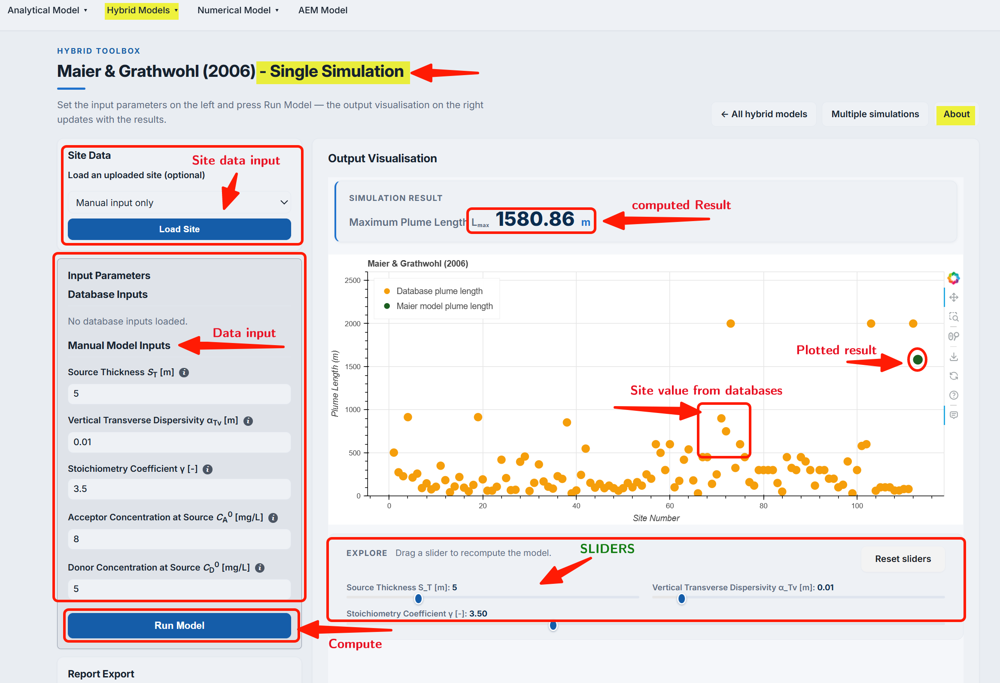
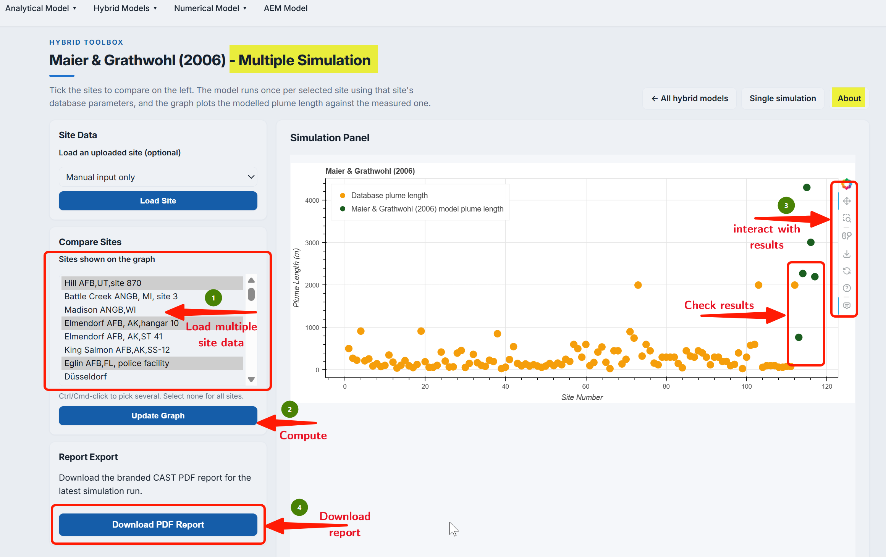
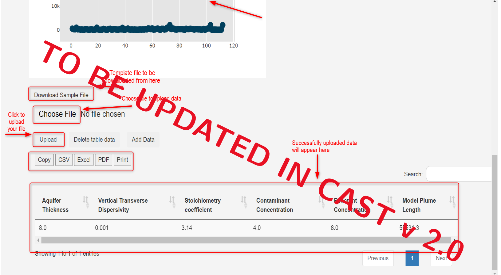

## Model Description

@maier2006 2D model provides an estimate of a steady-state plume length ($L_{max}$). The model is based on large number of numerical experimentation by varying several site parameters. The model expression is then developed based on statistical fitting the $L_{max}$ with model parameters. @maier2006 conceptual set-up (see figure below) is similar to that of [@liedl2005](../an_model/liedl2005.qmd).

::: {#fig-fig4.2-i}

{
width = "80%"
height = "400px"
fig-align="center" 
fig-alt="Conceptual setup of MG2006 model"}

@maier2006: Conceptual setup

:::

@maier2006 provides the following explicit expression for $L_{max}$ :

$$
 L_{max} = 0.5\frac{T_s^2}{\alpha_{Tv}}\bigg(\frac{\gamma C_{D}^o}{C_{A}^o}\bigg)^{0.3} 
$$

::: {.column-margin}
**Symbols**

$T_s$ = Source Length [L] 
$\alpha_{Tv}$ = Vertical Transverse Dispersivity [L] 
$\gamma$ = Reaction stoichiometric ratio [ ] 
$C_{D}^o$ = Contaminant (Electron Donor) concentration [ML$^{-3}$] 
$C_{A}^o$ = Partner Reactant (Electron Acceptor) concentration [ML$^{-3}$]
:::

**The model is based on the following assumptions:**

1. An saturated `homogeneous and isotropic` aquifer with uniform flow field. 
2. Contamination source penetrates the `entire aquifer thickness`.
3. Mixing of reactants leads to `instantaneous` reaction, which takes place at the fring of the plume leading to zero concentration.

## Using @maier2006 model

***Single computing interface***

The PACS user-interface for both hybrid and analytical models are identical. This is true for both single computing interface and multiple simulation interfaces. The identical interface simplifies the use of models in the PACS. The extensive details on using computing interface are provided [here - please check the lick](../an_model/liedl2005.qmd), which can be used also for the @maier2006 model.

The difference in each model interfaces of PACS is the model specific parameters. This can be observed in the screenshot (@fig-fig4.2-ii) below: 

::: {#fig-fig4.2-ii}

{
width = "80%"
height = "400px"
fig-align="center" 
fig-alt="Single computing interface of @maier2006 model"}

@maier2006: Single computing interface

:::

Once the input data is placed in the box, user needs to click on the ``Run Model`` to get the result. Results are obtained as an absolute number above the generated graph and also graphically, which provides the field plume length data from the database. This allows a visual comparison of the model $L_{max}$ with the field data. As explained in detail in [Liedl et al. (2005)](../an_model/liedl2005.qmd)  model, the resulting graph provides several interactive options to evaluate results. 

 **Dynamically comparing model results - using sliders**

**Sliders** (@fig-fig4.2-ii) are activated once the ``Run Model`` is clicked (see Interactive options in the Single computing interface). Sliders are provided for only critical model parameters that affects $L_{max}$ the most. The Sliders change the model input parameters, for which the output $L_{max}$ appears in the graph. This enables a dynamic computation and visualization.

***Multiple computing interface***

The multiple computing interface of the @maier2006 model is identical to analytical model [Liedl et al. (2005)](../an_model/liedl2005.qmd) model interface. The goal of the multiple computing interface is to develop several scenarios and compare the output of these scenarios with that of the field data. As can be observed in the screenshot below, users have an option to select the site(s) they would like to compare their scenarios with.

::: {#fig-fig4.2-iii}

{
width = "80%"
height = "400px"
fig-align="center" 
fig-alt="Multiple computing interface of @maier2006 model"}

@maier2006: Multiple computing interface

:::

The interface of multiple computing interface is provided in the screenshot (@fig-fig4.2-iv) below. Details on the options are identical to that provided for [Liedl et al. (2005)](../an_model/liedl2005.qmd). Interesting aspects of the interface are different options available for downloading model data and results in different formats. Also, important feature is the ability to load several model input parameter as a **.csv** file.

::: {#fig-fig4.2-iv}

{
width = "80%"
height = "400px"
fig-align="center" 
fig-alt="Data input method in multiple computing interface of @maier2006 model"}

@maier2006: Data input method in multiple computing interface

:::

