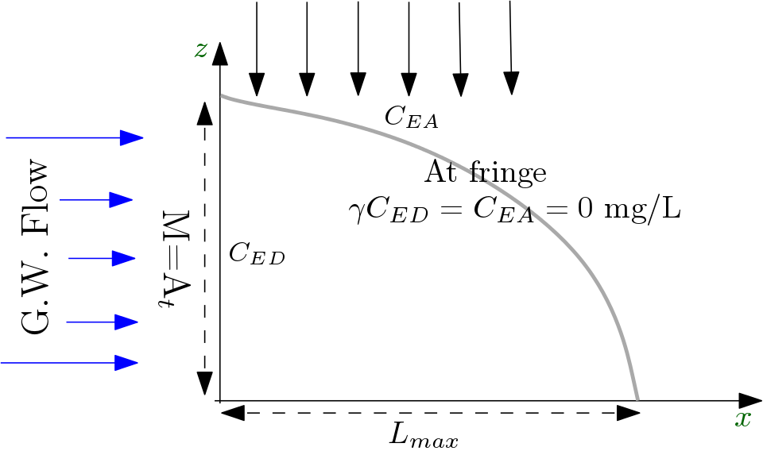
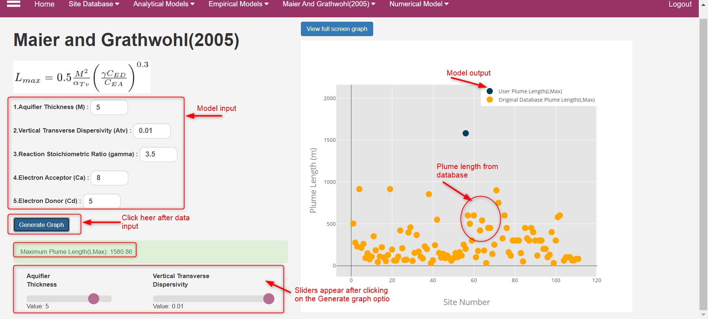
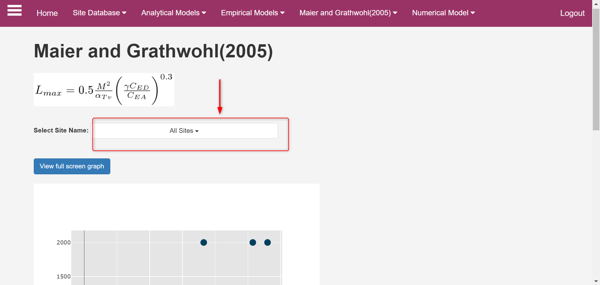
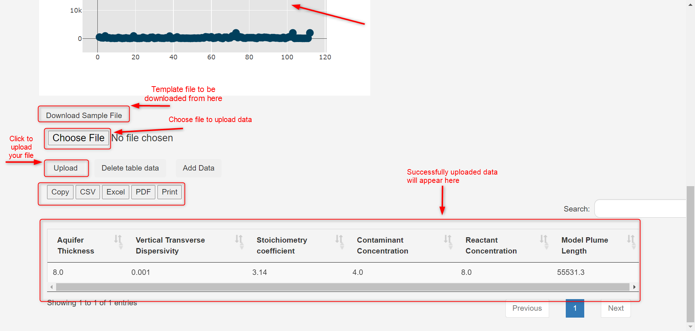

# i. Maier and Grathwohl (2006) Model {.unnumbered}

## Model Description

[Maier and Grathwohl](#refmg2006) 2D model provides an estimate of a steady-state plume length ($L_{max}$) using large numerical experimentation varying several site parameters. The model is then developed based on statistical fitting the $L_{max}$ with model parameters. Maier and Grathwohl (2006) conceptual set-up (see figure below) is similar to that of [Liedl et al. (2005)](../an_model/liedl2005.qmd).

{#fig-4-i-01 fig-align="center" width="50%"}

Maier and Grathwohl (2005) provides the following explicit expression for $L_{max}$ :

$$
L_{max} = 0.5\frac{M^2}{\alpha_{TV}}\bigg(\frac{\gamma C_{ED}}{C_{EA}}\bigg)^{0.3}
$$

::: {.column-margin}
**Symbols**

$M$ = Source Length [L] 
$\alpha_{TV}$ = Vertical Transverse Dispersivity [L] 
$\gamma$ = Reaction stoichiometric ratio [ ] 
$C_{ED}$ = Contaminant (Electron Donor) concentration [ML$^{-3}$] 
$C_{EA}$ = Partner Reactant (Electron Acceptor) concentration [ML$^{-3}$]
:::

**The model is based on the following assumptions:**

1. An saturated homogeneous isotropic aquifer with uniform flow field. 
2. Contamination source penetrates the entire aquifer thickness
3. Mixing of reactants leads to instant reaction, which takes place at the fring of the plume leading to zero concentration.

## Using the Model in CAST

***Single computing interface***

The CAST user-interface for Both the empirical models are identical. This is true for both single computing interface and multiple simulation interface. The identical interface simplifies the use of models in the CAST. Therefore, the extensive details on using CAST computing interface is provided [here](../an_model/liedl2005.qmd). The information there can be used also for the Maier and Grathwohl (2006).

The difference in each model interfaces of CAST is the model specific parameters. This can be observed in the screenshot below: 

{#fig-4-i-02 fig-align="center" width="50%"}

Once the input data is placed in the box, user needs to click on the ``Generate Graph`` to get the result. Results are obtained as an absolute number below the Generate Graph button and also graphically, which provides the field plume length data from the database. This allows a visual comparison of the model $L_{max}$ with the field data. As explained in detail in [Liedl et al. (2005)](../an_model/liedl2005.qmd)  model, the resulting graph provides several interactive options to evaluate results. 

 **Dynamically comparing model results - using sliders**

**Sliders** (@fig-4-i-02) are activated once the ``Generate Graph`` is clicked (see Interactive options in the Single computing interface). Sliders are provided for only critical model parameters that affects $L_{max}$ the most. The Sliders change the model input parameters, for which the output $L_{max}$ appears in the graph. This enables a dynamic computation and visualization.

***Multiple computing interface***

The multiple computing interface of the Maier and Grathwohl (2006) model is identical to analytical model [Liedl et al. (2005)](../an_model/liedl2005.qmd) model interface. The goal of the multiple computing interface is to develop several scenarios and compare the output of these scenarios with that of the field data. As can be observed in the screenshot below, users have an option to select the site(s) they would like to compare their scenarios with.

{#fig-4-i-03 fig-align="center" width="50%"}

The interface of multiple computing interface is provided in the screenshot below. Details on the options are identical to that provided for [Liedl et al. (2005)](../an_model/liedl2005.qmd). Interesting aspects of the interface are different options available for downloading model data and results in different formats. Also, important feature is the ability to load several model input parameter as a **.csv** file.

{#fig-4-i-04 fig-align="center" width="50%"}

## Reference {#refmg2006}

 U.Maier, P.Grathwohl (2006). Numerical experiments and field results on the size of steady state plumes. J Contam Hydrol, 85(1-2):33-52, https://doi.org/10.1016/j.jconhyd.2005.12.012